# Data-Flow Graphs — Carpenter App

> **What this is.** One data-flow graph per engineering concern, showing how a
> value flows from `CabinetInput` + `SavedCabinetState` through pure functions to
> a renderer. These are **data** flows (what feeds what), complementing the
> **dependency** view in [DEPENDENCY_GRAPH.md](DEPENDENCY_GRAPH.md).
>
> **How to keep it current.** Each graph names real functions. When you insert a
> stage, add a node and an edge; when you delete one, remove it. If a new renderer
> appears, it almost always hangs off an existing adapter node (`cabinetFrontPanels`,
> `cabinetBoardBoxes`, `cabinetSketchBoards`, `placementSubBoxAABBs`).
>
> **Legend.** `▢ pure function` · `▤ stateful/side-effect` · dashed edge = "must
> match / kept in sync". All dimensions cm unless a node says mm.

**Contents:** [Cabinet](#1-cabinet-generation) · [Board](#2-board-generation) ·
[Front](#3-front-generation) · [Hardware](#4-hardware-calculation) ·
[Material](#5-material-resolution) · [2D render](#6-2d-rendering) ·
[3D render](#7-3d-rendering) · [DXF](#8-dxf-generation-not-implemented) ·
[Cut list](#9-cut-list-generation) · [Sketch](#10-sketch-generation)

---

## 1. Cabinet generation

The spine every other flow branches from: input → carcasses → per-row layout → doors.

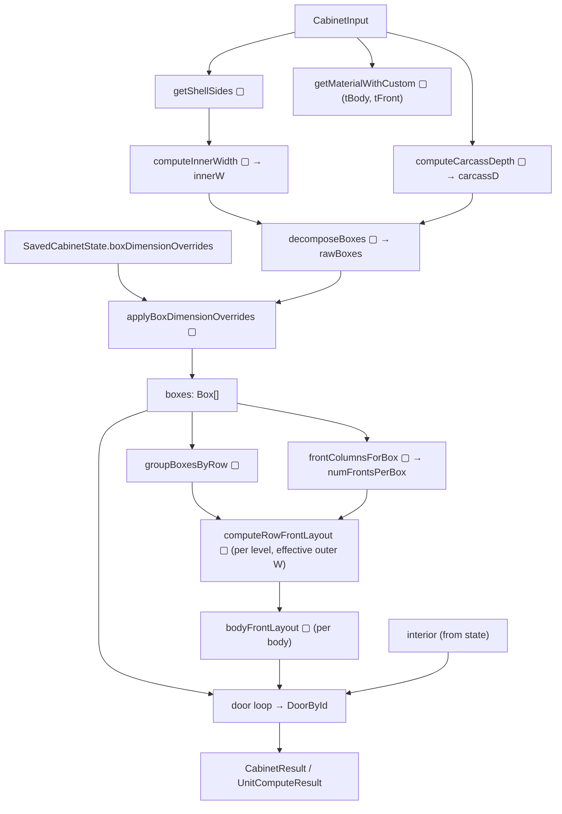

- **Sources of truth:** `getShellSides` (shell), `computeInnerWidth`/`computeCarcassDepth` (derived dims), `decomposeBoxes` (carcasses), `frontColumnsForBox` (door count), `bodyFrontLayout` (per-body door width).
- **Two runners:** `useCabinet.calculate` (live) and `computeUnitCutsAndHardware` (batch) run *this exact flow* — kept in sync by hand.
- **Effective outer width per row** = `(W − innerW) + Σ row body widths` — so a per-body `W` override widens that row's fronts to match the carcasses beneath.

---

## 2. Board generation

Carcass panels + plinth. This is the physical model that becomes both the cut list and the board renders.

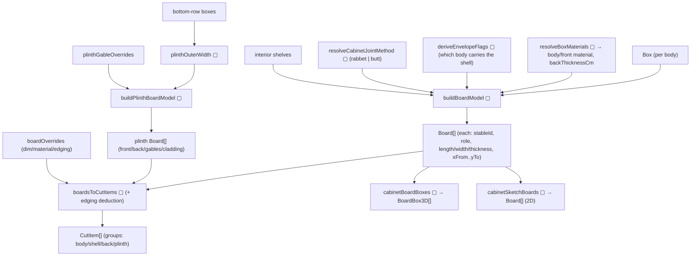

- **`Board.stableId`** (e.g. `side-left@bottom:left`) is the override key; `Board.id` is a fresh React key.
- **Edging deduction** happens only in `boardsToCutItems` (`none`/`front`/`perimeter`).
- **One board model → three consumers:** cut list, 3D, 2D sketch — the parity net (`renderParity.test.ts`) asserts they carry the same board-role census.

---

## 3. Front generation

Doors + external-drawer faces. Fronts are an overlay on the carcass; they size per-body.

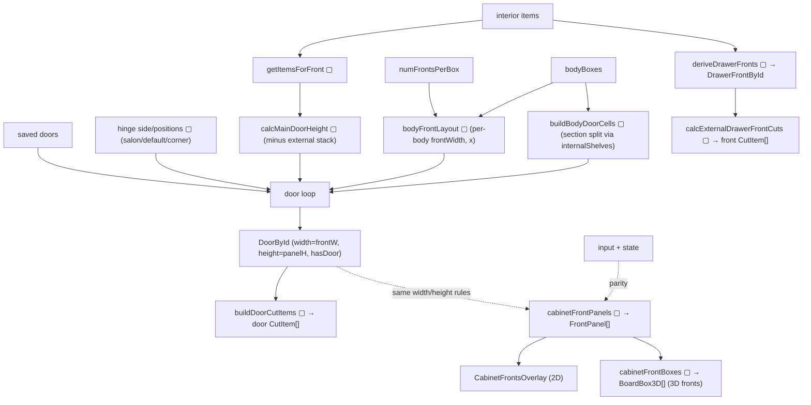

- **`DoorById` is the door-dimension SSOT** — `buildDoorCutItems` reads it, so the cut reflects overrides.
- **`cabinetFrontPanels` re-derives the same faces** for rendering. It is an *adapter*: `renderParity` asserts every rendered door width matches a cut-list door and no face overhangs `[0, W]`.
- **`hasDoor=false`** (height ≤ 0, or `hasFronts=false`) drops the door from both cuts and faces.

---

## 4. Hardware calculation

Counts + priced hardware sets, merged into one BOM.

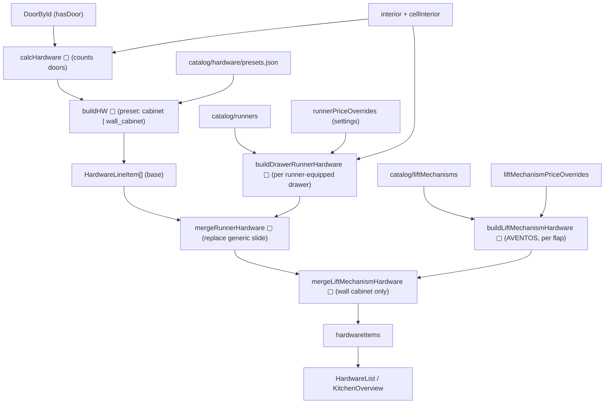

- **Runner-equipped drawers replace** the generic telescopic slide; a **קלפה AVENTOS** family replaces the generic lift line.
- Counts come from `hasDoor` doors + interior item types; prices are JSON + settings overrides.

---

## 5. Material resolution

How a body ends up cut from a specific sheet + coloured in 3D.

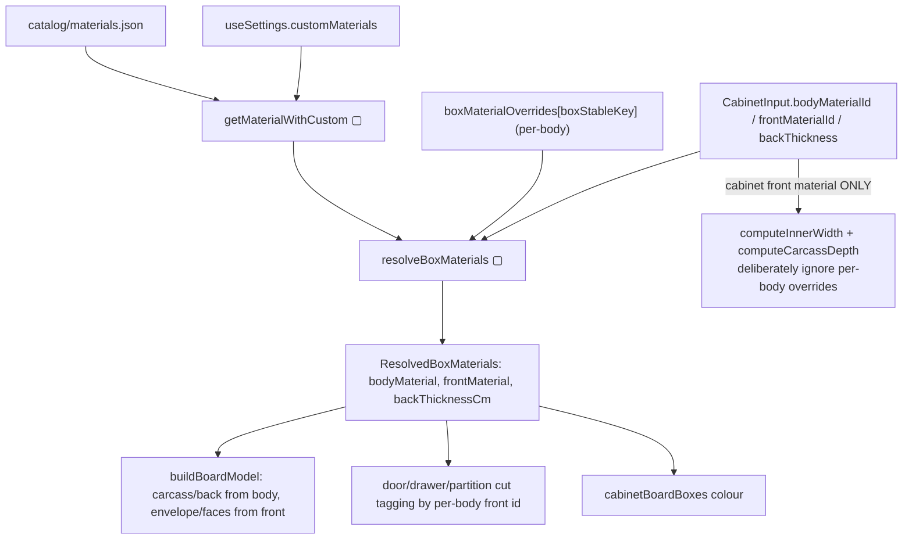

- **`resolveBoxMaterials` is the single per-body lookup** shared by cut/2D/3D.
- **Exception:** the cabinet-wide shell inset and carcass depth always use the *cabinet* front material (one physical shell).
- **Board-level material override** (`boardOverrides[stableId].materialId`) can re-sheet a single board (e.g. real-wood back), read via `getMaterial` in `boardsToCutItems`.

---

## 6. 2D rendering

Two 2D families: **bodies** (carcass elevation) and **fronts** (facade).

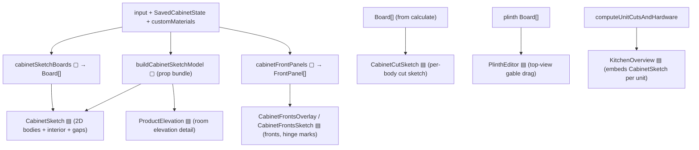

- `CabinetSketch` uses `computeSketchGeometry` (in `CabinetSketch.utils`) for the SVG scale/rects and `cabinetSketchBoards` for the role-tagged board set (the split that closed the "קלפה cap in body colour" bug).
- Interior clear-opening gaps come from `computeInteriorGaps` (`showGaps` prop, bodies views only).

---

## 7. 3D rendering

three.js meshes, from the same board model.

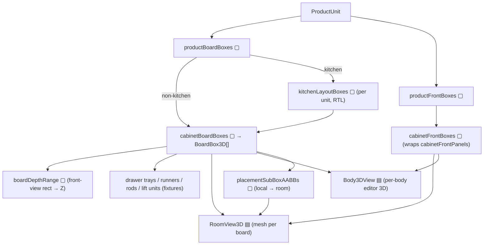

- `cabinetBoardBoxes` lifts each 2D board's front-view rect into 3D via `boardDepthRange` (per-role Z placement), then adds non-board fixtures (drawer box from `computeDrawerBox`, C-channel runners, rods, AVENTOS plates).
- Envelope/shell + plinth are emitted **once at cabinet level** so side panels run full height (matches the cut list).
- Kitchen units are laid out by `kitchenElevationLayout` and mirrored RTL to match `KitchenOverview`.

---

## 8. DXF generation — *NOT IMPLEMENTED*

> **Status: does not exist.** There is no DXF exporter in the codebase. DXF is
> listed only under "future direction" in `PROJECT_CONTEXT.md`. This section is a
> **placeholder + design sketch**, not documentation of existing behaviour.

**Current export surface (what *does* exist):**

| Export | Mechanism | Location |
|---|---|---|
| Cut list | `window.print()` (browser print of the rendered `CutsList`) | `CutsList.tsx` |
| Project file | JSON `Blob` download (`serializeProject`) | `useProject.ts` |
| CSV / PDF / DXF | — none — | — |

**If/when DXF is added, the natural data source is the board model**, because it
already carries per-board dimensions + 2D rectangles:

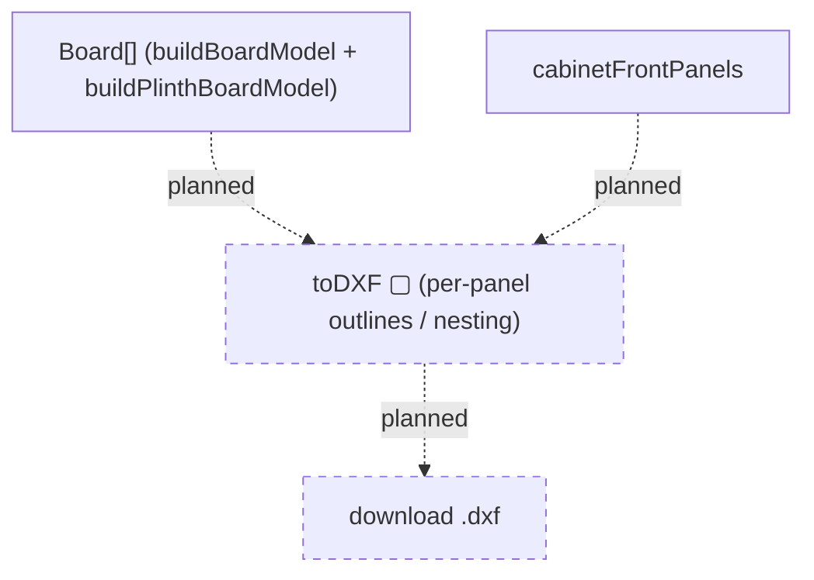

Recommended seam: a pure `core/export/toDxf.ts` consuming `Board[]`/`CutItem[]`
(never React), mirroring how `sheetCalculator` consumes `CutItem[]`. Do **not**
let a renderer build DXF.

---

## 9. Cut-list generation

The saw-operator's list = union of independent emitters, folded once.

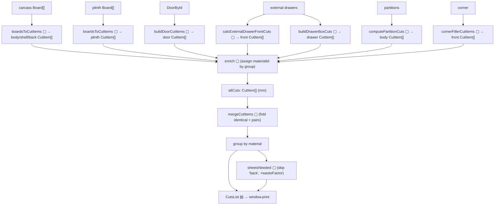

- **Assembly order** is owned by the orchestrators (`useCabinet.calculate` /
  `computeUnitCutsAndHardware`) — identical in both, by hand.
- **Kitchen:** `KitchenOverview` loops `computeUnitCutsAndHardware(..., {skipPlinth})`
  per unit and adds one **unified** kitchen-level plinth (`kitchenPlinth`).
- **Body view:** `computeUnitCutsAndHardware(..., {onlyBoxStableKey})` decomposes the
  whole cabinet (full row context) but emits cuts for **one body** — a faithful slice.

---

## 10. Sketch generation

"Sketch" = the SVG geometry layer feeding 2D views (distinct from the board model it renders).

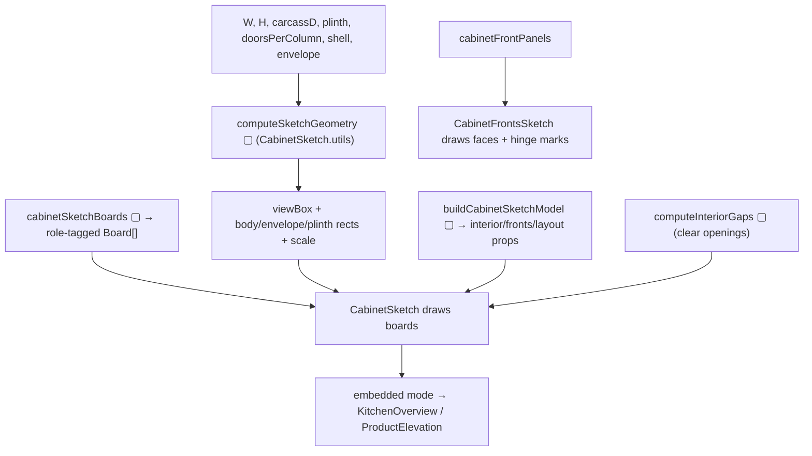

- `computeSketchGeometry` owns the SVG **layout** (rects, scale, envelope-cap presence — parity-checked); `cabinetSketchBoards` owns the **role-tagged board set**; `buildCabinetSketchModel` owns the **interior + front layout props**. Three concerns, three functions, one picture.
- The same `CabinetSketch` renders standalone (single cabinet), embedded (kitchen overview), and as room elevation detail (`ProductElevation`).

---

## Cross-cutting: the input → everything fan-out

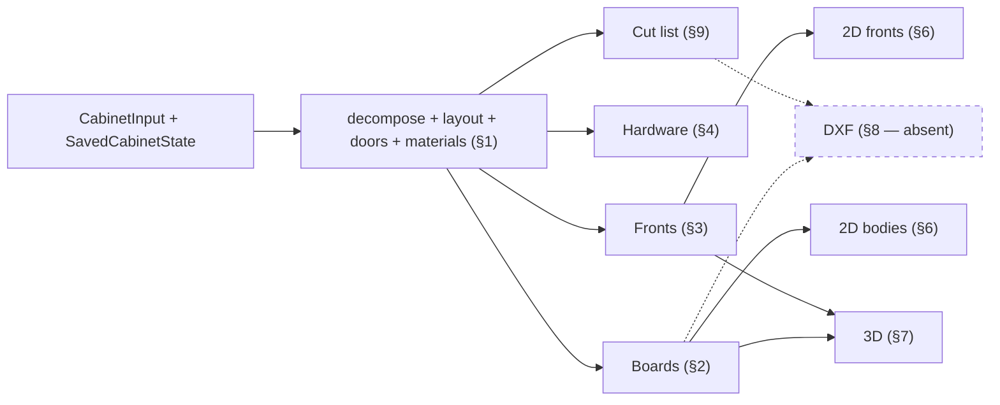
