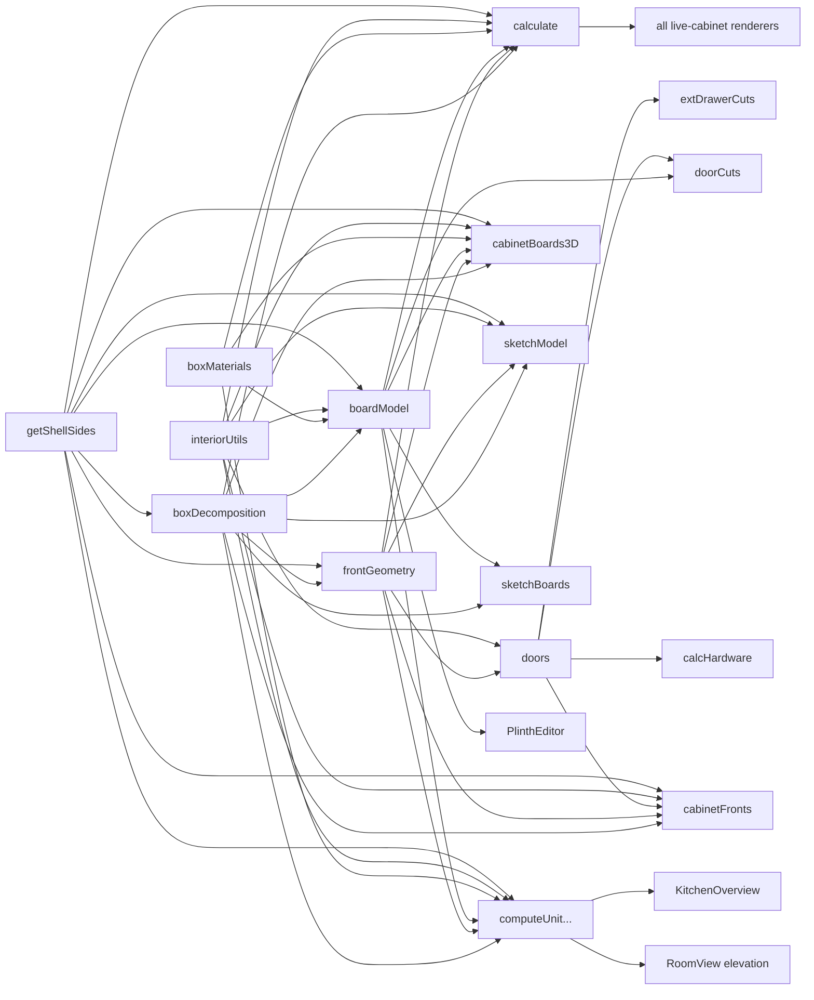

# Engineering Dependency Graph — Carpenter App

> **What this is.** An *engineering* dependency graph: how calculations, physical
> models, and renderers depend on each other — **not** an `import` graph. A module
> may `import` another and barely depend on it; here we track *"if X changes, does
> the meaning of Y change?"*.
>
> **How to keep it current.** This file is keyed to **function names and roles**,
> not line numbers. When you add a compute path or a renderer, add it to the
> subsystem table and the reverse-dependency section. The invariant checklist at
> the bottom is the fast way to tell whether a change is load-bearing. See also
> [DATA_FLOW_GRAPH.md](DATA_FLOW_GRAPH.md), [PIPELINES.md](PIPELINES.md),
> [SSOT_MAP.md](SSOT_MAP.md), [QA_SURFACE_MAP.md](QA_SURFACE_MAP.md).
>
> **Reading convention.** *Producer* = a subsystem whose output this one consumes.
> *Consumer* = a subsystem that consumes this one's output. *Pure* = no React, no
> I/O, deterministic from args. *Side-effect* = holds state, touches
> `localStorage`, or renders.

---

## 1. Subsystem map (layered)

```mermaid
flowchart TD
    subgraph CAT["Catalog (JSON-driven SSOT)"]
      MAT[materials / materialCombiner]
      HWCAT[hardware presets]
      RUN[runners]
      LIFT[liftMechanisms]
    end

    subgraph GEO["Geometry & physical models (pure)"]
      DEC[boxDecomposition]
      FG[frontGeometry]
      BM[boardModel]
      BMAT[boxMaterials]
      SHELL["cabinet.getShellSides"]
    end

    subgraph DOM["Domain engines (pure)"]
      DOOR[doors: doorCalc / doorUtils / bodyDoors / drawerFrontsCalc]
      INT[interior: interiorUtils / fixedShelfUtils]
      DRW[drawers: drawerBox / drawerBoxCuts / drawerDrilling / drawerRunnerHardware]
      LFT[lift: liftMechanismHardware]
      CORN[cornerModule]
      KMOD[kitchenModules / kitchenFootprint / kitchenPlinth]
    end

    subgraph CUTS["Cut & hardware assembly (pure)"]
      DCUT[doorCuts]
      ECUT[externalDrawerCuts]
      PCUT[partitionCuts]
      MERGE[mergeCutItems]
      SHEET[sheetCalculator]
      HW[calcHardware / hardwareCalc]
      LEG[cuttingList.calcCuts — legacy]
    end

    subgraph ORCH["Compute orchestrators"]
      CALC["useCabinet.calculate (live, stateful)"]
      CUC["cabinetCompute.computeUnitCutsAndHardware (pure, batch)"]
    end

    subgraph ADAPT["Render adapters (pure)"]
      FRONTS[cabinetFronts]
      B3D[cabinetBoards3D]
      SKM[cabinetSketchModel]
      SKB[cabinetSketchBoards]
      ROOM[productBounds / roomGeometry]
    end

    subgraph VIEW["Renderers (React, side-effect)"]
      CUTUI[CutsList]
      HWUI[HardwareList]
      SK2D[CabinetSketch / CabinetCutSketch]
      FR2D[CabinetFrontsSketch / CabinetFrontsOverlay]
      V3D[Body3DView / RoomView3D]
      RV[RoomView / ProductElevation]
      PLE[PlinthEditor]
      KOV[KitchenOverview]
    end

    subgraph STATE["State & persistence (side-effect)"]
      UCAB[useCabinet]
      UPRJ[useProject + serialize/migrations]
      USET[useSettings]
    end

    CAT --> BMAT & DRW & LFT & HW
    SHELL --> DEC & FG & BM
    DEC --> FG --> DOOR
    DEC --> BM
    BMAT --> BM
    DOOR --> DCUT & ECUT
    INT --> DOOR & BM
    BM --> DCUT
    DEC & FG & BM & BMAT & DOOR & INT & DRW & LFT & CORN --> CALC & CUC
    DCUT & ECUT & PCUT & MERGE & SHEET & HW --> CALC & CUC
    KMOD --> CUC
    CALC --> UCAB
    CUC --> KOV & RV
    UCAB --> CUTUI & HWUI & SK2D & FR2D & V3D & PLE
    DEC & FG & BM & BMAT & DOOR & INT --> FRONTS & B3D & SKM & SKB
    FRONTS --> FR2D & B3D
    B3D --> V3D
    SKM & SKB --> SK2D & RV
    ROOM --> RV & V3D
    USET --> UCAB & CUC
    UPRJ --> KOV & RV
```

---

## 2. Subsystem catalogue

Each row documents: **Responsibility · Inputs · Outputs · Source(s) of truth ·
Producers · Consumers · Purity · Engineering responsibility.**

### S1 — Box Decomposition · `core/geometry/boxDecomposition.ts`
- **Responsibility.** Split one cabinet (`innerW × H × carcassD` + plinth + rows) into physical carcasses (`Box[]`), enforcing `MAX_BOX_W=100`, `MAX_BOX_H=200` (auto), `MIN_BODY_HEIGHT=60` merge (`doorsPerColumn=3`), `MAX_PLINTH_W=240`. Apply per-body `W/H/D` overrides (`applyBoxDimensionOverrides`) and compute the plinth's effective outer width (`plinthOuterWidth`).
- **Inputs.** `innerW, H, carcassD, lowerDoorH?, plinth, doorsPerColumn, middleDoorH?, envelopeTopH, envelopeBottomH, noWidthSplit`; override record keyed by `boxStableKey`.
- **Outputs.** `Box[]` (each with `id`, `W/H/D`, `position`, `level`, optional `internalShelves`, `unitIndex/unitTotal`).
- **Source of truth.** The **only** place a cabinet becomes carcasses; owns split thresholds + the merged-body `internalShelves` rule.
- **Producers.** `getShellSides`/`computeInnerWidth`/`computeCarcassDepth` (S3) feed the args; caller passes them.
- **Consumers.** Every compute + adapter path: S10 (both orchestrators), S11 (all four adapters). Five paths independently re-decompose — see **[Duplicate calculations](#5-duplicate--drifting-calculations)**.
- **Purity.** Pure.
- **Engineering responsibility.** Carpentry rule "no carcass wider than 100 cm / taller than 200 cm; merge stubs under 60 cm".

### S2 — Front-Layout Geometry · `core/geometry/frontGeometry.ts`
- **Responsibility.** Convert a *row* of bodies into front (door/drawer-face) positions & widths. Row layout (`computeRowFrontLayout`), per-body layout (`bodyFrontLayout`, `bodyFrontX`, `bodySpanGeometry`), column count (`frontColumnsForBox`), row grouping (`groupBoxesByRow`, `getTotalFrontsInRow`).
- **Inputs.** Effective outer width, `shellSides`, `tFront`, `gapCm`, `maxDoorWidth`, `singleFront`, the row's boxes.
- **Outputs.** `RowFrontLayout`, `BodyFrontLayout`, `FrontPosition`, column counts.
- **Source of truth.** The **only** front x/width math; `frontColumnsForBox` is the single source for "how many doors does a body have".
- **Producers.** S1 (bodies), S3 (`tFront`, `innerW`), S4 (`getShellSides`).
- **Consumers.** S5 (door sizing), S10, S11 (all adapters).
- **Purity.** Pure.
- **Engineering responsibility.** "Each level is an independent horizontal row; each body sizes its own doors so a door never straddles a carcass boundary."

### S3 — Board Model · `core/boards/boardModel.ts`
- **Responsibility.** The **physical panel model**. `buildBoardModel` (per-body carcass/shelf/partition/envelope/back), `buildPlinthBoardModel` (cabinet-level kickboard + gables), `boardsToCutItems` (→ `CutItem[]` with edging deductions), plus the derived-dimension SSOTs: `computeInnerWidth`, `computeCarcassDepth`, `deriveEnvelopeFlags`, `resolveCabinetJointMethod`, and the override/edging resolvers `getDimension`/`getMaterial`/`resolveEdging`.
- **Inputs.** A `Box`, resolved body/front `Material`, envelope flags, interior items, edging context, board-override map.
- **Outputs.** `Board[]` (each with a **`stableId`** persistence key + `id` React key), `CutItem[]`.
- **Source of truth.** Every board's dimensions, roles, joint method (`rabbet`/`butt`), edge-banding deduction, and the carcass-derived dims (`innerW`, `carcassD`). Constants: `BACK_THICKNESS_CM`, `HINGE_GAP_CM=0.3`, `LEVELER_GAP_CM=0.6`.
- **Producers.** S1 (`Box`), S4 (materials), S6 (interior shelves).
- **Consumers.** S10 (cut list), S11 (`cabinetBoards3D`, `cabinetSketchBoards`), S12 (`PlinthEditor` reads effective dims).
- **Purity.** Pure.
- **Engineering responsibility.** Translates dimensions → cuttable panels; owns the rabbet/butt load rule and the leveler/hinge-gap reductions.

### S4 — Material Resolution · `core/boards/boxMaterials.ts` + `catalog/*` + `types/cabinet.getShellSides`
- **Responsibility.** Resolve the *effective* body material, front material, and back thickness for a body (`resolveBoxMaterials` = per-body override ?? cabinet default). `getShellSides` resolves per-side shell (falls back to `hasShell`). Catalog (`materialCombiner`) merges JSON catalog + custom materials.
- **Inputs.** `Box`, `CabinetInput`, `boxMaterialOverrides` (keyed by `boxStableKey`), custom materials.
- **Outputs.** `ResolvedBoxMaterials { bodyMaterial, frontMaterial, backThicknessCm }`; `{ left, right }` shell flags.
- **Source of truth.** The single per-body material lookup shared by cut/2D/3D. **Deliberate exception:** the shared shell inset + carcass depth always use the *cabinet* front material.
- **Producers.** Catalog JSON, `useSettings` (custom materials).
- **Consumers.** S3, S10, S11.
- **Purity.** Pure.
- **Engineering responsibility.** "One cabinet-wide shell; per-body faces may differ."

### S5 — Door & Hinge Engine · `core/doors/{doorCalc,doorUtils,bodyDoors,drawerFrontsCalc}.ts`
- **Responsibility.** Row/height split (`calcDoors`); hinge count/positions/side, `calcMainDoorHeight`, `calcExternalStackHeight`, `coversSkirt` (`doorUtils`); section-split cells for merged bodies (`bodyDoors.buildBodyDoorCells`, `makeSavedDoorKey`); external-drawer face derivation (`drawerFrontsCalc.deriveDrawerFronts`).
- **Inputs.** Bodies, per-body front width (from S2), interior items, `doorGapMm`, `doorCoversPlinth`, saved doors.
- **Outputs.** `DoorById`, `DrawerFrontById`, hinge arrays.
- **Source of truth.** Door/hinge geometry + the "door absent when height ≤ 0" and "one door per (box, frontIndex, sectionIndex)" rules.
- **Producers.** S1, S2, S6.
- **Consumers.** S9 (`doorCuts`, `externalDrawerCuts`), S8 (hardware counts), S10, S11 (`cabinetFronts`).
- **Purity.** Pure.
- **Engineering responsibility.** Facade decomposition + hinge placement.

### S6 — Interior Placement · `core/interior/{interiorUtils,fixedShelfUtils}.ts`
- **Responsibility.** Shelf redistribution, drawer/rod default placement + warnings, `boxStableKey` (the persistence key), `computeInteriorGaps`/`physicalZone` (clear-opening dims), auto fixed-shelf reconciliation above external drawers.
- **Inputs.** Item list, container height, `shelfThickness`, `doorGapMm`.
- **Outputs.** `{ items, warnings }`, `InteriorGap[]`, `boxStableKey` strings.
- **Source of truth.** `boxStableKey(box) = "level:position"` — the key **all** saved state is stored under. `physicalZone` — the single definition of an item's occupied span, reused by both warnings and gap display.
- **Producers.** —
- **Consumers.** S3 (shelves→boards), S5 (hinge gaps), S10/S11, all interior editors + sketches.
- **Purity.** Pure.
- **Engineering responsibility.** Ergonomic shelf spacing + stable identity across recomputes.

### S7 — Drawer / Runner / Lift Hardware Engine · `core/drawers/*` + `core/lift/*`
- **Responsibility.** Blum TANDEM drawer-box geometry (`drawerBox`, `drawerBoxCuts`), runner drilling datum (`drawerDrilling`), priced runner hardware (`drawerRunnerHardware`), AVENTOS lift hardware (`liftMechanismHardware`).
- **Inputs.** `DrawerItem` (runner id, thicknesses, mount), box `D`/inner width, catalog runner/lift specs, price overrides.
- **Outputs.** Drawer-box `CutItem[]`, `HardwareLineItem[]` (runner sets, lift sets), 3D fixture geometry inputs.
- **Source of truth.** Drawer-box part sizes + runner NL banding + AVENTOS selection.
- **Producers.** Catalog `runners`/`liftMechanisms`, `useSettings` (price overrides).
- **Consumers.** S10, S11 (`cabinetBoards3D` draws the tray/runner), S8 (merge into BOM).
- **Purity.** Pure.
- **Engineering responsibility.** Hardware-accurate drawer construction.

### S8 — Hardware BOM · `core/hardware/{calcHardware,hardwareCalc}.ts`
- **Responsibility.** Count doors/drawers/shelves/rods → hardware line items from a JSON preset (`buildHW`). Wall cabinets pass `'wall_cabinet'`.
- **Inputs.** `DoorById`, interior + cell interior, furniture type.
- **Outputs.** `HardwareLineItem[]` (later merged with runner/lift sets by S7 helpers).
- **Source of truth.** Preset-driven counts (`catalog/hardware/presets.json`).
- **Producers.** S5 (doors), S6 (interior), catalog presets.
- **Consumers.** S10 (`hardwareItems`), `HardwareList`, `KitchenOverview`.
- **Purity.** Pure.
- **Engineering responsibility.** Bill of materials for fittings.

### S9 — Cut & Sheet Assembly · `core/cuts/*`
- **Responsibility.** `doorCuts.buildDoorCutItems` (door panels from `DoorById` — **the** door-dim SSOT), `externalDrawerCuts`, `partitionCuts`, `mergeCutItems` (fold identical + carpentry pairs), `sheetCalculator.sheetsNeeded` (sheet count, skips `back`, ×`wasteFactor`). `cuttingList.calcCuts` is **legacy** — off the live cabinet path (see §5).
- **Inputs.** `DoorById`, interior items, boards, edging, materials.
- **Outputs.** `CutItem[]` (mm), folded list, sheet counts.
- **Source of truth.** Door-cut dimensions come from `buildDoorCutItems` (tracks overrides), *not* `calcCuts`. `mergeCutItems` is the single folding rule every consumer sees.
- **Producers.** S3 (boards), S5 (doors), S7 (drawer parts).
- **Consumers.** S10, `CutsList`.
- **Purity.** Pure.
- **Engineering responsibility.** The saw-operator's list.

### S10 — Compute Orchestrators · `ui/hooks/useCabinet.calculate` + `core/cabinetCompute.computeUnitCutsAndHardware`
- **Responsibility.** Run the whole pipeline: decompose → per-row/per-body layout → doors → boards → cuts → hardware → (live) interior/door preservation. `calculate` is the **live** stateful path (one active cabinet); `computeUnitCutsAndHardware` is the **pure batch** path (kitchen aggregation + body-view projection via `onlyBoxStableKey`).
- **Inputs.** `CabinetInput` + overrides (live refs / `SavedCabinetState`) + custom materials + price overrides.
- **Outputs.** `CabinetResult` (`boxes, cuts, doors, carcassD, innerW, hardwareItems, derivedBoxDims`) / `UnitComputeResult` (`cuts, hardwareItems`).
- **Source of truth.** The *assembly order*. **These two are hand-mirrored and MUST stay in sync** (documented in `cabinetCompute.ts` header).
- **Producers.** S1–S9, S12.
- **Consumers.** `calculate` → S16 renderers via `useCabinet`; `computeUnitCutsAndHardware` → `KitchenOverview`, `CabinetForm` 3D preview, `RoomView` (indirectly).
- **Purity.** `calculate` = side-effect (React state). `computeUnitCutsAndHardware` = pure.
- **Engineering responsibility.** The build recipe.

### S11 — Render Adapters · `core/product/{cabinetFronts,cabinetBoards3D,cabinetSketchModel,cabinetSketchBoards}.ts`
- **Responsibility.** Re-project the *same* decomposition into renderer shapes: `cabinetFrontPanels` (`FrontPanel[]` faces, floor-up) → 2D overlay + 3D fronts; `cabinetBoardBoxes`/`productBoardBoxes`/`productFrontBoxes` (`BoardBox3D[]`) → 3D; `buildCabinetSketchModel` (prop bundle) + `cabinetSketchBoards` (`Board[]`) → 2D sketch/elevation.
- **Inputs.** `CabinetInput` + `SavedCabinetState` + custom materials (i.e. the *persisted* form, not live refs).
- **Outputs.** Renderer-native geometry in cabinet-local / product-local cm.
- **Source of truth.** **None of their own** — they are *adapters* that must match S10's cut list. Guarded by `renderParity.test.ts`.
- **Producers.** S1–S6.
- **Consumers.** S16 renderers.
- **Purity.** Pure.
- **Engineering responsibility.** "What the cut list describes is exactly what the eye sees."

### S12 — Product & Module Models · `core/product/{cornerModule,kitchenModules,kitchenFootprint,kitchenPlinth,productDefaults}.ts`
- **Responsibility.** Corner-unit geometry SSOT (`cornerModule`: door + L-filler + hinge-post return, `noWidthSplit`); kitchen module presets (`kitchenModules`); kitchen elevation/footprint layout (`kitchenFootprint`) + unified plinth grouping (`kitchenPlinth`); default inputs/state (`productDefaults`).
- **Inputs.** Module type, kitchen units.
- **Outputs.** `CabinetInput`/`SavedCabinetState` defaults, corner cut/2D/3D geometry, kitchen layout rectangles + plinth cuts.
- **Source of truth.** Corner geometry (cut/2D/3D read from `cornerModule`); kitchen elevation layout (`kitchenElevationLayout`).
- **Producers.** —
- **Consumers.** S10, S11, S13, `KitchenOverview`, `KitchenEditor`.
- **Purity.** Pure.
- **Engineering responsibility.** Domain shapes that aren't a plain box.

### S13 — Room & Placement · `core/room/{productBounds,roomGeometry}.ts`
- **Responsibility.** Product bounds + local sub-boxes (`productBounds`, `productSubBoxes`); the single local→room transform (`placementSubBoxAABBs`) that the top view, elevation (`placementElevationRects`), and 3D all project from; wall snap/clamp (`snapToWall`, `clampCentreToRoom`, `facesWall`).
- **Inputs.** `ProductUnit`, `ProductPlacement`, `Room`.
- **Outputs.** `ProductBounds`, `ProductSubBox[]`, `RoomAABB[]`, `ElevationRect[]`, `TopViewRect`.
- **Source of truth.** Room coordinate system (Y-up, origin back-left-floor, cm) + the one transform all three room views share.
- **Producers.** S12 (kitchen footprint).
- **Consumers.** `RoomView`, `RoomView3D`.
- **Purity.** Pure.
- **Engineering responsibility.** Floor-plan placement + projection consistency.

### S14 — State & Persistence · `ui/hooks/{useCabinet,useProject,useSettings}` + `core/project/{serialize,migrations}`
- **Responsibility.** `useCabinet` holds the live cabinet SSOT + override refs + snapshot/restore. `useProject` holds `Project` (`products[]`, kitchen units, `rooms[]`), `localStorage` save/load, JSON file **export/import** (Blob download). `useSettings` holds `AppSettings` in `localStorage`. `serialize`/`migrations` = pure `Project ↔ JSON` + schema versioning.
- **Inputs.** User actions; JSON.
- **Outputs.** React state; persisted JSON.
- **Source of truth.** `useCabinet` = the single live-cabinet state; `SavedCabinetState` = the persisted override schema.
- **Producers.** S10 (`calculate`).
- **Consumers.** All renderers.
- **Purity.** Side-effect (React + `localStorage`). `serialize`/`migrations` pure.
- **Engineering responsibility.** Durable user choices; stable identity across sessions.

### S15 — Pricing · `core/pricing/laborCalc.ts` *(dormant)*
- **Responsibility.** Labor cost estimate. **Not wired to the UI.**
- **Purity.** Pure. **Consumers.** None (yet).
- **Engineering responsibility.** Future costing.

### S16 — Renderers · `ui/components/*`
- **Responsibility.** View-only. `CutsList` (→ `window.print`), `HardwareList`, `CabinetSketch`/`CabinetCutSketch` (2D bodies), `CabinetFrontsSketch`/`CabinetFrontsOverlay` (2D fronts), `Body3DView`/`RoomView3D` (three.js), `RoomView`/`ProductElevation` (floor plan/elevation), `PlinthEditor`, `KitchenOverview` (aggregation UI).
- **Inputs.** Outputs of S10/S11/S13 via hooks/props.
- **Outputs.** DOM/SVG/WebGL + `window.print` (cut list) + JSON download (project).
- **Purity.** Side-effect. **Consumers.** The user.
- **Engineering responsibility.** Faithful display; **must not compute** (CLAUDE.md rule).

---

## 3. Reverse dependency graph — "If this changes, what may break?"

Read as: **the node points at everything that must be re-verified if it changes.**

| If you change… | Directly re-derives | Downstream renderers that can silently drift | Guardrail |
|---|---|---|---|
| **`boxDecomposition`** (thresholds, split, `internalShelves`, override application) | S2, S3, both orchestrators, **all 4 adapters** | Cut list, 2D bodies, 2D fronts, 3D, kitchen aggregation | `renderParity.test.ts` census; `boxDecomposition` tests |
| **`frontGeometry`** (`frontColumnsForBox`, row/body layout, x-positions) | S5, orchestrators, adapters | Door count/width everywhere; drawer-face x; overhang | `frontGeometry.test.ts`; renderParity "door width matches", "faces within [0,W]" |
| **`boardModel`** (board dims, roles, joint, edging, `computeInnerWidth/CarcassDepth`) | `doorCuts` (via boxes), orchestrators, `cabinetBoards3D`, `cabinetSketchBoards`, `PlinthEditor` | Cut list dims, 2D/3D board census, sheet count | `boardModel.test.ts`; renderParity census |
| **`boxMaterials`** (`resolveBoxMaterials`) | S3, orchestrators, `cabinetBoards3D` | Cut-list material grouping, 3D colours, cost | `boxMaterials.test.ts`; `cabinetCompute.test.ts` per-body material |
| **`doorUtils`/`doorCalc`/`bodyDoors`** | `doorCuts`, `externalDrawerCuts`, `calcHardware`, `cabinetFronts` | Door heights, hinge markers, skirt cover, section-split doors | `doorCalc.test.ts`, `doorUtils.test.ts`, renderParity front geometry |
| **`interiorUtils.boxStableKey`** | **Everything persisted** | Any saved interior/doors/partitions/overrides orphan if the key formula changes | `serialize.test.ts` round-trip |
| **`getShellSides`** | Decompose, layout, boards, all paths | inner width → every downstream dimension | Covered transitively by renderParity |
| **`useCabinet.calculate`** | The live UI | All live-cabinet renderers | Must be mirrored by `computeUnitCutsAndHardware` (see §5) |
| **`cabinetCompute`** | Kitchen aggregation, body-view projection, 3D preview | `KitchenOverview`, `CabinetForm` preview | `cabinetCompute.test.ts`, `renderParity.test.ts` |
| **`mergeCutItems`** | Cut-list folding | `CutsList`, `sheetsNeeded` totals | `mergeCutItems.test.ts` |
| **A catalog JSON** (material/hardware/runner/lift) | S4/S7/S8 | Prices, thicknesses, sheet counts, BOM | Edit JSON only (CLAUDE.md); catalog tests |

---

## 4. Rendering adapters (the "must-match-the-cut-list" layer)

An **adapter** re-projects the decomposition into a renderer's native shape but
holds **no truth of its own** — it must agree with the cut list. There are four:

| Adapter | Output type | Feeds | Parity guard |
|---|---|---|---|
| `cabinetFronts.cabinetFrontPanels` | `FrontPanel[]` (faces, floor-up) | `CabinetFrontsOverlay` (2D), `cabinetFrontBoxes` (3D) | renderParity: faces within `[0,W]`, clear caps, door width matches cut |
| `cabinetBoards3D.cabinetBoardBoxes` / `productBoardBoxes` / `productFrontBoxes` | `BoardBox3D[]` | `Body3DView`, `RoomView3D` | renderParity: 3D↔cut structural census + bounding-box guard |
| `cabinetSketchModel.buildCabinetSketchModel` | prop bundle | `CabinetSketch`, `ProductElevation` | (layout) implicitly via renderParity front geometry |
| `cabinetSketchBoards.cabinetSketchBoards` | `Board[]` | `CabinetSketch` (2D bodies) | renderParity: 2D↔cut structural census |

> **Rule.** A renderer never re-derives geometry from raw input; it consumes an
> adapter. New renderer → new adapter (or reuse one) → add a parity case.

---

## 5. Duplicate / drifting calculations

Known, *deliberate* duplication — each is a maintenance hazard tracked here.

1. **`useCabinet.calculate` ⇄ `cabinetCompute.computeUnitCutsAndHardware`.**
   The full pipeline is implemented **twice**: once stateful (live cabinet), once
   pure (batch). The header of `cabinetCompute.ts` says: *"If logic in
   useCabinet.calculate() changes, this function must be kept in sync."* **The
   single biggest drift risk in the codebase.**
   - `computeUnitCutsAndHardware` applies overrides straight from `SavedCabinetState`;
     `calculate` holds them in live refs and preserves interactively-edited doors/interior.

2. **Five-path decompose+layout.** `decomposeBoxes` + `applyBoxDimensionOverrides`
   + `computeRowFrontLayout` + `frontColumnsForBox` is repeated in **five** places:
   `useCabinet`, `cabinetCompute`, `cabinetFronts`, `cabinetBoards3D`,
   `cabinetSketchModel`. Mitigated by (a) the shared helpers
   `applyBoxDimensionOverrides` + `plinthOuterWidth`, and (b) `renderParity.test.ts`.
   The auto-split plan ([plan file](../../.claude/plans)) is collapsing more of this into the one seam.

3. **`buildBoxLabel`** duplicated verbatim in `useCabinet.ts` and `cabinetCompute.ts`
   ("keep in sync" comment).

4. **`cuttingList.calcCuts` (cabinet door path) — superseded / off the live path.**
   Door cuts now come from `buildDoorCutItems`; carcass from `buildBoardModel`;
   drawer-box parts from `buildDrawerBoxCuts`. **Neither orchestrator imports
   `calcCuts`** — it is exercised only by unit tests and remains for legacy
   furniture types (`shelf`/`table`/`drawer_unit`/`custom`). Candidate for removal
   once those types are confirmed unreachable.

5. **`core/index.ts` barrel** re-exports ~30 symbols but only 2 are consumed through
   it (`decomposeBoxes`, `calcDoors`). Documented dead-ish code (see `PROJECT_CONTEXT.md`).

---

## 6. Engineering invariants (inferred from code — not invented)

Each is traceable to a specific function/comment. See
[QA_SURFACE_MAP.md](QA_SURFACE_MAP.md) for the test that pins each one.

1. **Entered `W/H/D` are EXTERNAL.** `innerW = W − shell(s)` (`computeInnerWidth`);
   `carcassD = D − backThickness − HINGE_GAP_CM − tFront` (`computeCarcassDepth`).
   Envelope panels use full `D`; carcass panels use the reduced depth.
2. **`boxStableKey = "level:position"` is the persistence key.** `Box.id` (`box_N`)
   resets every `calculate()`; all saved state keys off `boxStableKey`.
3. **`Board.stableId` survives rebuilds; `Board.id` is a React key only.**
4. **Decomposition runs at INPUT width, overrides applied after.** Overriding one
   body past `MAX_BOX_W` does **not** re-split it today (`cabinetSketchModel` note;
   the auto-split plan changes this in the decompose seam).
5. **Split thresholds:** `MAX_BOX_W=100`, `MAX_BOX_H=200` (auto), `MIN_BODY_HEIGHT=60`
   (merge, `doorsPerColumn=3`), `MAX_PLINTH_W=240`.
6. **Each `Box.level` is an independent front row** with its own `RowFrontLayout`.
7. **Per-body door sizing:** each body sizes doors from its own width
   (`bodyFrontLayout`); a door never straddles a carcass. Uniform bodies match the
   row-even width within ≤1 mm.
8. **Door cuts derive from finished `DoorById`** via `buildDoorCutItems` — so they
   reflect per-body `W/H` overrides and external-drawer shortening (not `input.W`).
9. **The cut list = union of independent emitters:** carcass boards
   (`buildBoardModel`→`boardsToCutItems`), doors (`buildDoorCutItems`), external
   fronts (`calcExternalDrawerFrontCuts`), partitions (`computePartitionCuts`),
   drawer-box parts (`buildDrawerBoxCuts`), plinth boards.
10. **Render census invariant:** 3D (`cabinetBoardBoxes`) and 2D
    (`cabinetSketchBoards`) agree with the cut list on the **multiset of structural
    board roles** (`renderParity.test.ts`). Front faces stay within `[0,W]`, clear
    the top/bottom caps, and every rendered door width matches a cut-list door.
11. **Envelope side panels span the FULL cabinet height, emitted once (bottom row)**
    to avoid duplicates (`deriveEnvelopeFlags`). Envelope = front material; carcass
    = body material.
12. **Shell inset + carcass depth always use the CABINET front material**, even
    under a per-body material override (`boxMaterials` note).
13. **A merged body (`doorsPerColumn=3`) carries body-local `internalShelves`** and
    emits **k+1 stacked (section-split) doors**, keyed `boxId:fi:si`.
14. **A main door of height ≤ 0** (full external-drawer stack) is **absent**
    (`hasDoor=false`) — not cut, no hinges; render omits it.
15. **`hasFronts=false`** (appliance bays) → all doors `hasDoor=false` → no `'door'`
    cuts.
16. **The plinth follows the bottom row's EFFECTIVE (overridden) width**
    (`plinthOuterWidth`) — cut list, 2D, 3D, `PlinthEditor` all read it.
17. **`sheetsNeeded` skips group `'back'`** and applies `APP_DEFAULTS.wasteFactor`.
18. **`mergeCutItems` folds identical `(materialId,w,h,name)`** and optionally the
    carpentry pairs (top/bottom, sides, envelope sides, plinth gables, sink
    traverses) — in core, so every consumer sees one compact list.
19. **Room views are all projections of one `productSubBoxes` set** via the single
    `placementSubBoxAABBs` transform (Y-up, origin back-left-floor, cm).
20. **`getShellSides` is the single source** for per-side shell (falls back to
    `hasShell`).
21. **Edging deduction:** `none`→0; `front`→1×t on `width`; `perimeter`→2×t on both
    axes (doors/drawer fronts opt into `perimeter`).
22. **Corner units are one wide carcass (`noWidthSplit`)** with a fixed-width door +
    L-filler; hinges always on the filler side; geometry from `cornerModule` for
    cut/2D/3D.
