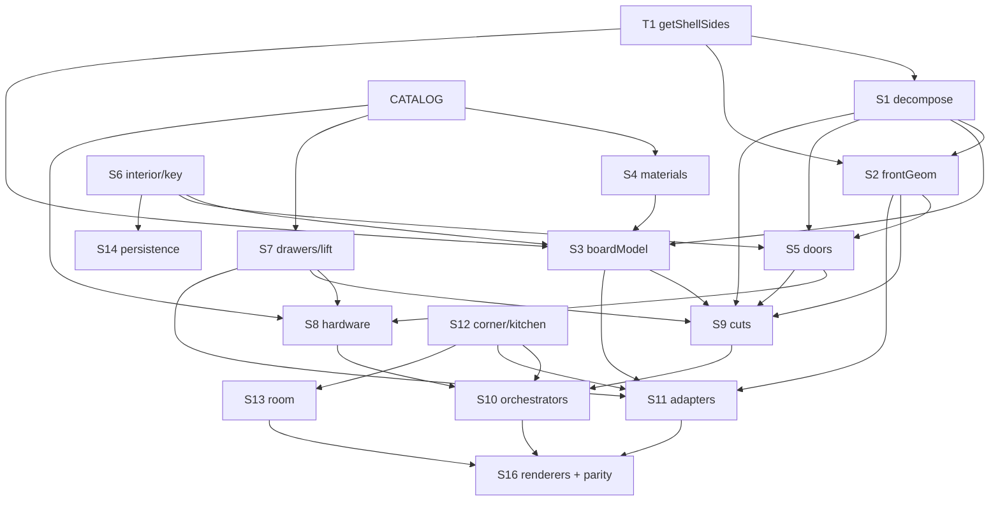

# Impact Analysis System — Carpenter App

> **What this is.** A lookup system that turns *"I changed file X"* into *"run this
> QA"* — deterministically. It is built on the subsystems (S1–S16), invariants
> (INV-1…22), exports, and drift hazards (D1–D6) from
> [DEPENDENCY_GRAPH.md](DEPENDENCY_GRAPH.md), [SSOT_MAP.md](SSOT_MAP.md), and
> [QA_STRATEGY.md](QA_STRATEGY.md).
>
> **How to use it (fast path).** ① Find your changed file in the
> [Path → subsystem index](#1-change-classification--path--subsystem-index). ② Take
> its subsystem's row in the [Propagation matrix](#2-propagation-matrix-transitive-impact-closure).
> ③ Read that subsystem's [impact record](#3-per-subsystem-impact-records) for
> renderers / exports / calculations / invariants / suites. ④ Apply any
> [special-case rule](#4-special-case-propagation-rules-the-hazards) that fires.
> The [machine-readable map](#5-machine-readable-impact-map) + [algorithm](#6-qa-selection-algorithm)
> automate steps ①–④.
>
> **How to keep it current.** This file is keyed to **file paths, exported symbols,
> and test filenames** — all stable. When you add a module, add a path-index row + an
> impact record + a machine-map entry. When you add a test, add it to the relevant
> subsystem's suite list. `[proposed]` marks suites from
> [QA_STRATEGY.md](QA_STRATEGY.md) not yet implemented.

---

## 1. Change classification — path → subsystem index

The **entry point**: map each changed path to its subsystem(s) and tier. Tier drives
blast radius (foundational fans out widest).

| Path (source of truth) | Subsystem | Tier |
|---|---|---|
| `src/types/cabinet.ts` (`getShellSides`) | **T1** (shell SSOT) | Foundational |
| `src/core/utils/round.ts` | **UTIL** | Foundational leaf |
| `src/core/geometry/boxDecomposition.ts` | **S1** | Foundational |
| `src/core/geometry/frontGeometry.ts` | **S2** | Foundational |
| `src/core/boards/boardModel.ts` | **S3** | Foundational |
| `src/core/boards/boxMaterials.ts` | **S4** | Derived |
| `src/core/doors/{doorCalc,doorUtils,bodyDoors,drawerFrontsCalc}.ts` | **S5** | Derived |
| `src/core/interior/{interiorUtils,fixedShelfUtils}.ts` | **S6** | Foundational (identity) |
| `src/core/drawers/*` · `src/core/lift/*` | **S7** | Derived |
| `src/core/hardware/{calcHardware,hardwareCalc}.ts` | **S8** | Leaf |
| `src/core/cuts/{doorCuts,externalDrawerCuts,partitionCuts,mergeCutItems,sheetCalculator}.ts` | **S9** | Derived |
| `src/core/cuts/cuttingList.ts` (`calcCuts`) | **S9-legacy** | Off live path (D4) |
| `src/core/cabinetCompute.ts` | **S10-pure** | Orchestrator |
| `src/ui/hooks/useCabinet.ts` (`calculate`) | **S10-live** | Orchestrator |
| `src/core/product/cabinetFronts.ts` | **S11-fronts** | Adapter |
| `src/core/product/cabinetBoards3D.ts` | **S11-3d** | Adapter |
| `src/core/product/{cabinetSketchModel,cabinetSketchBoards}.ts` | **S11-2d** | Adapter |
| `src/ui/components/CabinetSketch.utils.ts` (`computeSketchGeometry`) | **S11-2d** | Adapter (SVG layout) |
| `src/core/product/cornerModule.ts` | **S12-corner** | Domain model |
| `src/core/product/{kitchenModules,kitchenFootprint,kitchenPlinth,productDefaults}.ts` | **S12-kitchen** | Domain model |
| `src/core/room/{productBounds,roomGeometry}.ts` | **S13** | Projection |
| `src/core/project/{serialize,migrations}.ts` | **S14-core** | Persistence |
| `src/ui/hooks/{useProject,useSettings}.ts` | **S14-state** | Persistence |
| `src/core/geometry/dimensionConsistency.ts` | **VALID** (warnings) | Non-blocking validation |
| `src/core/pricing/laborCalc.ts` | **S15** | Dormant |
| `src/catalog/**/*.json` · `src/catalog/*.ts` | **CATALOG** | Data (JSON-driven) |
| `src/ui/components/*.tsx` (renderers) | **S16** | Renderer |
| `src/i18n/*` | **I18N** | Copy only |

> A file may hit **two** subsystems (e.g. editing `frontGeometry` when it also touches
> a `types` shape) — take the union of impacts.

---

## 2. Propagation matrix (transitive impact closure)

Change a subsystem → these subsystems' behaviour may change. **Run the closure, not
just the direct row.** `→` = directly impacts; the closure column is the full set to
treat as impacted.

| Change in | Directly impacts | **Transitive closure (treat all as impacted)** |
|---|---|---|
| **T1** getShellSides | S1,S2,S3 | S1,S2,S3,S4,S5,S9,S10,S11,S13,S16 (≈ everything) |
| **UTIL** round | (numeric leaves) | any consumer that rounds — broad but shallow |
| **S1** decompose | S2,S3,S5,S9 | S2,S3,S4,S5,S6,S7,S9,S10,S11,S12,S13,S16 |
| **S2** frontGeometry | S5,S9,S11 | S5,S9,S10,S11,S16 |
| **S3** boardModel | S9,S11 | S9,S10,S11,S16 (+ PlinthEditor) |
| **S4** boxMaterials | S3,S9,S11 | S3,S9,S10,S11,S16 |
| **S5** doors | S8,S9,S11 | S8,S9,S10,S11,S16 |
| **S6** interior (`boxStableKey`) | S3,S5,S10,S14 | S3,S5,S9,S10,S11,S14,S16 (+ **all persistence**) |
| **S7** drawers/lift | S8,S9,S11 | S8,S9,S10,S11,S16 |
| **S8** hardware | S10 | S10,S16 (HardwareList, KitchenOverview) |
| **S9** cuts | S10 | S10,S16 (CutsList, KitchenOverview) |
| **S10** orchestrators | S16 (all) | **S16 (all live renderers) + parity net** |
| **S11** adapters | S16 (their renderers) | S16 subset per adapter |
| **S12** corner/kitchen | S10,S11,S13 | S10,S11,S13,S16 |
| **S13** room/placement | S16 (room) | S16 (RoomView, RoomView3D) |
| **S14** persistence | (load/save) | correctness of restore → S10 on load |
| **CATALOG** | S4,S7,S8 | S4,S7,S8,S9(sheets),S10,S16 |
| **VALID** | (warnings UI) | S16 banners only — non-blocking |
| **S15** pricing | — | — |
| **S16** renderers | — | visual only |



---

## 3. Per-subsystem impact records

Each record answers the six required questions. **Suites** lists real `*.test.ts`
files + the parity net; `[proposed]` = from [QA_STRATEGY.md](QA_STRATEGY.md), not yet built.

### T1 · `getShellSides` (`types/cabinet.ts`)
- **What breaks.** Inner width → every downstream dimension in every path.
- **Renderers affected.** All (2D bodies/fronts, 3D, cut list, kitchen, room).
- **Exports affected.** `getShellSides` → consumed by S1,S2,S3,S10,S11.
- **Calculations affected.** `computeInnerWidth`, row layout, envelope flags.
- **Invariants.** INV-1, INV-20, INV-11.
- **Suites.** `boardModel`, `frontGeometry`, `renderParity` (+ [differential], [golden]).

### S1 · Box Decomposition (`geometry/boxDecomposition.ts`)
- **What breaks.** Carcass count/size, merge, `internalShelves`, plinth width, override application — the spine of every path.
- **Renderers affected.** **All.**
- **Exports affected.** `decomposeBoxes`, `splitWidth`, `applyBoxDimensionOverrides`, `plinthOuterWidth`, `MAX_BOX_W/MAX_BOX_H/MAX_PLINTH_W` → S2,S3,S5,S9,S10, all 4 adapters.
- **Calculations affected.** width/height split, body merge, plinth outer width, override.
- **Invariants.** INV-4, INV-5, INV-13, INV-16 (+ INV-4 idempotence for Phase-3 auto-split).
- **Suites.** `boxDecomposition`, `renderParity` (census, all paths), `cabinetCompute`, `bodyDoors` (+ [property P-DEC-1/2], [golden]).

### S2 · Front-Layout Geometry (`geometry/frontGeometry.ts`)
- **What breaks.** Door count/width/x; drawer-face x; door↔carcass alignment (straddle).
- **Renderers affected.** Fronts (2D/3D), cut list, all bodies views (column counts).
- **Exports affected.** `computeRowFrontLayout`, `bodyFrontLayout`, `bodyFrontX`, `bodySpanGeometry`, `frontColumnsForBox`, `groupBoxesByRow` → S5,S9,S10, all adapters.
- **Calculations affected.** row layout, per-body sizing prefix-sum, column count.
- **Invariants.** INV-6, INV-7.
- **Suites.** `frontGeometry`, `renderParity` (door-width match, faces within [0,W]), `cabinetFronts`, `cabinetCompute` (+ [property P-FRONT-1/2]).

### S3 · Board Model (`boards/boardModel.ts`)
- **What breaks.** Every carcass/plinth dimension, role, joint, edging deduction, sheet count.
- **Renderers affected.** Cut list, 2D bodies (`CabinetSketch`/`CabinetCutSketch`), 3D, `PlinthEditor`.
- **Exports affected.** `buildBoardModel`, `buildPlinthBoardModel`, `boardsToCutItems`, `deriveEnvelopeFlags`, `resolveCabinetJointMethod`, `computeCarcassDepth`, `computeInnerWidth`, `getDimension/getMaterial/resolveEdging`, `calcPlinthGables`, `Board`/`BoardRole` → S9,S10,S11,S13.
- **Calculations affected.** carcass depth, inner width, joint, envelope, edging, gable positions.
- **Invariants.** INV-1, INV-3, INV-10, INV-11, INV-17, INV-21.
- **Suites.** `boardModel`, `renderParity` (all 3 census), `cabinetCompute`, `sheetCalculator` (+ [property P-BOARD-1/2], [mutation core]).

### S4 · Material Resolution (`boards/boxMaterials.ts` + catalog)
- **What breaks.** Cut-list material grouping, 3D colour, cost; per-body override behaviour.
- **Renderers affected.** Cut list, 3D, kitchen (mixed-material).
- **Exports affected.** `resolveBoxMaterials`, `ResolvedBoxMaterials`, `BoxMaterialOverride` → S3,S10,S11.
- **Calculations affected.** effective material lookup; back thickness.
- **Invariants.** INV-12.
- **Suites.** `boxMaterials`, `cabinetCompute` (per-body material), `renderParity` (+ [metamorphic P-MAT-1]).

### S5 · Door & Hinge Engine (`doors/*`)
- **What breaks.** Door heights, hinges, skirt-cover, section split, external-stack shortening, absent-door.
- **Renderers affected.** Fronts (2D/3D), cut list, `DoorsList`, hardware count.
- **Exports affected.** `calcDoors`, `doorUtils.*`, `buildBodyDoorCells`, `makeSavedDoorKey`, `deriveDrawerFronts` → S8,S9,S10,S11.
- **Calculations affected.** row split, `calcMainDoorHeight`, `calcExternalStackHeight`, hinge positions, `getSkirtCoveringDrawer`.
- **Invariants.** INV-7, INV-8, INV-13, INV-14, INV-15.
- **Suites.** `doorCalc`, `doorUtils`, `bodyDoors`, `deriveDrawerFronts`, `externalDrawer`, `externalDrawerWiring`, `renderParity`, `cabinetCompute`.

### S6 · Interior Placement (`interior/*`)
- **What breaks.** Shelf spacing/warnings, gap display, fixed-shelf sync, **and `boxStableKey` → all persisted state**.
- **Renderers affected.** 2D bodies (gaps), interior editors, sketches.
- **Exports affected.** `boxStableKey` (**identity — critical**), `initInteriorFromBoxes`, `redistributeShelves`, `computeInteriorGaps`, `physicalZone`, `newItemId`, `filterItemsForHeight`, `syncFixedShelf` → S3,S5,S10,S11,S14.
- **Calculations affected.** shelf redistribution, `physicalZone`, gap merge.
- **Invariants.** INV-2 (`boxStableKey`), INV-22.
- **Suites.** `interiorUtils`, `fixedShelfUtils`, **`serialize` (round-trip — run if `boxStableKey` changes)** (+ [orphan detector]).

### S7 · Drawer / Runner / Lift Engine (`drawers/*`, `lift/*`)
- **What breaks.** Drawer-box parts, runner NL/drilling, priced runner sets, AVENTOS sets, 3D tray/runner/lift geometry.
- **Renderers affected.** Cut list (drawer parts), 3D fixtures, hardware.
- **Exports affected.** `computeDrawerBox`, `selectNominalLength`, `buildDrawerBoxCuts`, `buildDrawerRunnerHardware`, `mergeRunnerHardware`, `buildLiftMechanismHardware`, `mergeLiftMechanismHardware` → S8,S9,S10,S11-3d.
- **Calculations affected.** NL banding, drawer-box sizing, drilling datum, price bands.
- **Invariants.** (hardware-exact; drawer-box ≡ cut list).
- **Suites.** `drawerBox`, `drawerBoxCuts`, `drawerDrilling`, `drawerRunnerHardware`, `liftMechanismHardware`, `cabinetCompute` (runner/lift hw).

### S8 · Hardware BOM (`hardware/*`)
- **What breaks.** Fitting counts + costs.
- **Renderers affected.** `HardwareList`, `KitchenOverview`.
- **Exports affected.** `calcHardware`, `buildHW` → S10.
- **Calculations affected.** count-by-type × preset rule.
- **Invariants.** preset counts (door/drawer/shelf/rod).
- **Suites.** `hardwareCalc`, `cabinetCompute` (hardware).

### S9 · Cut & Sheet Assembly (`cuts/*` except legacy)
- **What breaks.** Door cut dims, external/partition cuts, fold, sheet count.
- **Renderers affected.** `CutsList`, `KitchenOverview`.
- **Exports affected.** `buildDoorCutItems`, `calcExternalDrawerFrontCuts`, `computePartitionCuts`, `mergeCutItems`, `sheetsNeeded/ByGroup` → S10.
- **Calculations affected.** door cut = f(`DoorById`), fold key, sheet area.
- **Invariants.** INV-8, INV-9, INV-17, INV-18.
- **Suites.** `doorCuts`, `mergeCutItems`, `sheetCalculator`, `partitionCuts`, `renderParity`, `cabinetCompute`.

### S10 · Compute Orchestrators (`cabinetCompute.ts` + `useCabinet.calculate`)
- **What breaks.** The whole recipe → cut list, hardware, and everything rendered. **A change here is the widest-impact change possible.**
- **Renderers affected.** **All** (live via `useCabinet`; batch via `KitchenOverview`, `RoomView`, 3D preview).
- **Exports affected.** `computeUnitCutsAndHardware` (+ options `skipPlinth`/`onlyBoxStableKey`); `useCabinet` hook API (`calculate`, `result`, setters, `getSnapshot`, `restoreState`).
- **Calculations affected.** stage order (§1 of [PIPELINES.md](PIPELINES.md)), emitter union, preservation.
- **Invariants.** **all** INV-#.
- **Suites.** `cabinetCompute`, `renderParity`, `cabinetFronts`, `cabinetBoards3D` (+ **[differential P-ORCH-1] — mandatory**, [golden masters]). **D1 rule fires (see §4).**

### S11 · Render Adapters (`product/cabinetFronts|cabinetBoards3D|cabinetSketchModel|cabinetSketchBoards`, `CabinetSketch.utils`)
- **What breaks.** Rendered geometry drifting from the cut list.
- **Renderers affected.** Per adapter — fronts→`CabinetFrontsSketch/Overlay`+3D; 3d→`Body3DView`/`RoomView3D`; 2d→`CabinetSketch`/`ProductElevation`/`CabinetCutSketch`.
- **Exports affected.** `cabinetFrontPanels`, `cabinetBoardBoxes`, `productBoardBoxes`, `productFrontBoxes`, `cabinetFrontBoxes`, `buildCabinetSketchModel`, `cabinetSketchBoards`, `computeSketchGeometry`, `BoardBox3D`, `FrontPanel`.
- **Calculations affected.** re-projection only (owns no truth) — Z placement, SVG scale, RTL kitchen layout.
- **Invariants.** INV-7 (containment), INV-10 (census), INV-11 (caps).
- **Suites.** `renderParity` (**primary**), `cabinetFronts`, `cabinetBoards3D`, `cabinetSketchModel`, `CabinetSketch.utils` (+ [deterministic SVG snapshot], [carpenter checklist]).

### S12 · Product & Module Models (`product/cornerModule|kitchenModules|kitchenFootprint|kitchenPlinth|productDefaults`)
- **What breaks.** Corner cut/2D/3D geometry; kitchen module defaults; kitchen layout/elevation; unified plinth; default inputs.
- **Renderers affected.** `KitchenOverview`, `RoomView`/`RoomView3D` (kitchen), corner in all views.
- **Exports affected.** `isCorner`, `cornerFrontXLayout`, `cornerHingeSide`, `cornerFillerCutItems`, `cornerReturnBox`, `kitchenModuleInput/State`, `kitchenElevationLayout`, `kitchenFootprint`, `groupKitchenUnitsForPlinth`, `buildKitchenPlinthCuts`, `defaultInputForType`, `emptyCabinetState` → S10,S11,S13.
- **Calculations affected.** corner geometry, kitchen elevation, plinth grouping.
- **Invariants.** INV-22 (corner); kitchen layout.
- **Suites.** `cornerModule`, `kitchenModules`, `kitchenFootprint`, `kitchenPlinth`, `renderParity` (corner + all kitchen cases).

### S13 · Room & Placement (`room/*`)
- **What breaks.** Product bounds/sub-boxes; top/elevation/3D projection; wall snap/clamp.
- **Renderers affected.** `RoomView` (top+elevation), `RoomView3D`.
- **Exports affected.** `productBounds`, `productSubBoxes`, `placementSubBoxAABBs`, `placementElevationRects`, `snapToWall`, `clampCentreToRoom`, `facesWall`, `placementRectTopView`, `placementAABB`, `maxWallOffset`.
- **Calculations affected.** local→room transform, rotation, elevation mirror.
- **Invariants.** INV-19 (one transform for all room views).
- **Suites.** `productBounds`, `roomGeometry` (+ [property P-ROOM-1]).

### S14 · Persistence & State (`project/serialize|migrations`, `useProject`, `useSettings`)
- **What breaks.** Save/load correctness, migration, override restore, settings.
- **Renderers affected.** None directly — but a bad restore surfaces everywhere on load.
- **Exports affected.** `serializeProject`, `deserializeProject`, `migrate`, `CURRENT_SCHEMA_VERSION`; `useProject`/`useSettings` APIs.
- **Calculations affected.** Map↔Object bridge, migration chain, validation.
- **Invariants.** INV-2 (round-trip on `boxStableKey`/`stableId`).
- **Suites.** `serialize` (+ [round-trip property P-PERSIST-1], [migration totality], [orphan detector]).

### CATALOG · (`catalog/**`)
- **What breaks.** Prices, thicknesses, sheet sizes, hardware/runner/lift specs → cut dims, sheet counts, BOM totals.
- **Renderers affected.** `CutsList`, `HardwareList`, cost readouts.
- **Exports affected.** `getMaterialWithCustom`, `getRunner`, `getLiftMechanism`, `HW_PRESETS`.
- **Calculations affected.** material thickness → every `t`-derived dim; price × qty.
- **Invariants.** (data, not logic) — **edit JSON only** (CLAUDE.md).
- **Suites.** `hardwareCalc`, `sheetCalculator`, `drawerRunnerHardware`, `liftMechanismHardware`, `boxMaterials`.

### VALID · `geometry/dimensionConsistency.ts`
- **What breaks.** Warning banners only (`h_mismatch`/`w_mismatch`/`v_gap`) — **never blocks** (freedom principle).
- **Renderers.** `CabinetForm` banners. **Exports.** warning kinds. **Invariants.** warnings-not-throws. **Suites.** `dimensionConsistency`.

### S15 · Pricing (`pricing/laborCalc.ts`) — dormant
- **What breaks.** Nothing (unwired). **Suites.** none until a consumer exists.

### S16 · Renderers (`ui/components/*.tsx`)
- **What breaks.** Display only (must not compute). **Renderers = self.** **Exports.** none consumed by core. **Invariants.** visual (colour/z-order/layout). **Suites.** [deterministic SVG snapshot] (2D) + [carpenter checklist] (3D/pixels).

---

## 4. Special-case propagation rules (the hazards)

These **override or augment** the mechanical closure — always check them.

| Rule | Fires when | Mandatory extra QA |
|---|---|---|
| **D1 — orchestrator sync** | Any change to a pipeline stage in `useCabinet.calculate` **or** `cabinetCompute` | Apply the change to **both twins**; run `cabinetCompute` + `renderParity`; **[differential test]**. Reviewer confirms parity. |
| **D2 — five-path prologue** | Any change to decompose/override/row-layout used by adapters | Run `renderParity` (all 3 census paths) + `cabinetFronts` + `cabinetBoards3D` + `cabinetSketchModel`. |
| **D3 — `buildBoxLabel` copy** | Editing the label in one orchestrator | Mirror in the other; grep both. |
| **Persistence identity** | Changing `boxStableKey` or `Board.stableId` formula | Run `serialize` round-trip + [orphan detector]; consciously accept saved-project cost. |
| **Catalog data** | Any `catalog/**` edit | Run CATALOG suites; **no TS logic change** (JSON only). |
| **New cabinet shape / module / override combo** | New domain case | Add a `renderParity` `CASES` entry (the contract surface). |
| **D4 — `calcCuts` legacy** | Editing `cuttingList.calcCuts` | Note: **does not affect live cabinets**; `cuttingList` tests green ≠ production covered. |
| **Warnings (VALID)** | Editing `dimensionConsistency` | Assert a warning is *produced*, never that it throws. |

---

## 5. Machine-readable impact map

The data a CI script consumes. Keys are source paths (globs allowed). `closure` is the
subsystem set to treat as impacted; `suites` are runnable test files; `[proposed]`
suites are omitted from the machine list until they exist. Keep this block in sync with
§1–§3.

```json
{
  "version": 1,
  "note": "changedFile -> subsystem -> impact. Union across all changed files. Then apply special_rules.",
  "subsystems": {
    "T1":       { "paths": ["src/types/cabinet.ts"], "closure": ["S1","S2","S3","S4","S5","S9","S10","S11","S13","S16"], "invariants": ["INV-1","INV-11","INV-20"], "renderers": ["*"], "suites": ["boardModel","frontGeometry","renderParity"] },
    "S1":       { "paths": ["src/core/geometry/boxDecomposition.ts"], "closure": ["S2","S3","S4","S5","S6","S7","S9","S10","S11","S12","S13","S16"], "invariants": ["INV-4","INV-5","INV-13","INV-16"], "renderers": ["*"], "suites": ["boxDecomposition","renderParity","cabinetCompute","bodyDoors"] },
    "S2":       { "paths": ["src/core/geometry/frontGeometry.ts"], "closure": ["S5","S9","S10","S11","S16"], "invariants": ["INV-6","INV-7"], "renderers": ["CabinetFrontsSketch","CabinetFrontsOverlay","CutsList","CabinetSketch","Body3DView","RoomView3D","KitchenOverview"], "suites": ["frontGeometry","renderParity","cabinetFronts","cabinetCompute"] },
    "S3":       { "paths": ["src/core/boards/boardModel.ts"], "closure": ["S9","S10","S11","S13","S16"], "invariants": ["INV-1","INV-3","INV-10","INV-11","INV-17","INV-21"], "renderers": ["CutsList","CabinetSketch","CabinetCutSketch","Body3DView","RoomView3D","PlinthEditor"], "suites": ["boardModel","renderParity","cabinetCompute","sheetCalculator"] },
    "S4":       { "paths": ["src/core/boards/boxMaterials.ts"], "closure": ["S3","S9","S10","S11","S16"], "invariants": ["INV-12"], "renderers": ["CutsList","Body3DView","RoomView3D","KitchenOverview"], "suites": ["boxMaterials","cabinetCompute","renderParity"] },
    "S5":       { "paths": ["src/core/doors/doorCalc.ts","src/core/doors/doorUtils.ts","src/core/doors/bodyDoors.ts","src/core/doors/drawerFrontsCalc.ts"], "closure": ["S8","S9","S10","S11","S16"], "invariants": ["INV-7","INV-8","INV-13","INV-14","INV-15"], "renderers": ["CabinetFrontsSketch","CabinetFrontsOverlay","CutsList","DoorsList","Body3DView","RoomView3D"], "suites": ["doorCalc","doorUtils","bodyDoors","deriveDrawerFronts","externalDrawer","externalDrawerWiring","renderParity","cabinetCompute"] },
    "S6":       { "paths": ["src/core/interior/interiorUtils.ts","src/core/interior/fixedShelfUtils.ts"], "closure": ["S3","S5","S9","S10","S11","S14","S16"], "invariants": ["INV-2","INV-22"], "renderers": ["CabinetSketch","BoxInteriorEditor"], "suites": ["interiorUtils","fixedShelfUtils","serialize"] },
    "S7":       { "paths": ["src/core/drawers/*","src/core/lift/*"], "closure": ["S8","S9","S10","S11","S16"], "invariants": [], "renderers": ["CutsList","HardwareList","Body3DView","RoomView3D"], "suites": ["drawerBox","drawerBoxCuts","drawerDrilling","drawerRunnerHardware","liftMechanismHardware","cabinetCompute"] },
    "S8":       { "paths": ["src/core/hardware/calcHardware.ts","src/core/hardware/hardwareCalc.ts"], "closure": ["S10","S16"], "invariants": [], "renderers": ["HardwareList","KitchenOverview"], "suites": ["hardwareCalc","cabinetCompute"] },
    "S9":       { "paths": ["src/core/cuts/doorCuts.ts","src/core/cuts/externalDrawerCuts.ts","src/core/cuts/partitionCuts.ts","src/core/cuts/mergeCutItems.ts","src/core/cuts/sheetCalculator.ts"], "closure": ["S10","S16"], "invariants": ["INV-8","INV-9","INV-17","INV-18"], "renderers": ["CutsList","KitchenOverview"], "suites": ["doorCuts","mergeCutItems","sheetCalculator","partitionCuts","renderParity","cabinetCompute"] },
    "S10-pure": { "paths": ["src/core/cabinetCompute.ts"], "closure": ["S11","S16"], "invariants": ["ALL"], "renderers": ["*"], "suites": ["cabinetCompute","renderParity","cabinetFronts","cabinetBoards3D"], "special": ["D1","D2"] },
    "S10-live": { "paths": ["src/ui/hooks/useCabinet.ts"], "closure": ["S16"], "invariants": ["ALL"], "renderers": ["*"], "suites": ["renderParity"], "special": ["D1","D3"] },
    "S11-fronts": { "paths": ["src/core/product/cabinetFronts.ts"], "closure": ["S16"], "invariants": ["INV-7","INV-10","INV-11"], "renderers": ["CabinetFrontsSketch","CabinetFrontsOverlay","Body3DView","RoomView3D"], "suites": ["cabinetFronts","renderParity"] },
    "S11-3d":   { "paths": ["src/core/product/cabinetBoards3D.ts"], "closure": ["S16"], "invariants": ["INV-10"], "renderers": ["Body3DView","RoomView3D"], "suites": ["cabinetBoards3D","renderParity"] },
    "S11-2d":   { "paths": ["src/core/product/cabinetSketchModel.ts","src/core/product/cabinetSketchBoards.ts","src/ui/components/CabinetSketch.utils.ts"], "closure": ["S16"], "invariants": ["INV-10","INV-11"], "renderers": ["CabinetSketch","CabinetCutSketch","ProductElevation"], "suites": ["cabinetSketchModel","CabinetSketch.utils","renderParity"] },
    "S12-corner": { "paths": ["src/core/product/cornerModule.ts"], "closure": ["S10","S11","S13","S16"], "invariants": ["INV-22"], "renderers": ["CutsList","CabinetSketch","Body3DView","RoomView3D"], "suites": ["cornerModule","renderParity"] },
    "S12-kitchen": { "paths": ["src/core/product/kitchenModules.ts","src/core/product/kitchenFootprint.ts","src/core/product/kitchenPlinth.ts","src/core/product/productDefaults.ts"], "closure": ["S10","S11","S13","S16"], "invariants": [], "renderers": ["KitchenOverview","RoomView","RoomView3D"], "suites": ["kitchenModules","kitchenFootprint","kitchenPlinth","renderParity"] },
    "S13":      { "paths": ["src/core/room/productBounds.ts","src/core/room/roomGeometry.ts"], "closure": ["S16"], "invariants": ["INV-19"], "renderers": ["RoomView","RoomView3D"], "suites": ["productBounds","roomGeometry"] },
    "S14":      { "paths": ["src/core/project/serialize.ts","src/core/project/migrations.ts","src/ui/hooks/useProject.ts","src/ui/hooks/useSettings.ts"], "closure": ["S10","S16"], "invariants": ["INV-2"], "renderers": [], "suites": ["serialize"] },
    "CATALOG":  { "paths": ["src/catalog/**"], "closure": ["S4","S7","S8","S9","S10","S16"], "invariants": [], "renderers": ["CutsList","HardwareList"], "suites": ["hardwareCalc","sheetCalculator","drawerRunnerHardware","liftMechanismHardware","boxMaterials"] },
    "VALID":    { "paths": ["src/core/geometry/dimensionConsistency.ts"], "closure": ["S16"], "invariants": [], "renderers": ["CabinetForm"], "suites": ["dimensionConsistency"] },
    "S9-legacy":{ "paths": ["src/core/cuts/cuttingList.ts"], "closure": [], "invariants": [], "renderers": [], "suites": ["cuttingList"], "special": ["D4"] },
    "UTIL":     { "paths": ["src/core/utils/round.ts"], "closure": ["*"], "invariants": [], "renderers": ["*"], "suites": ["round","renderParity","cabinetCompute"] },
    "S15":      { "paths": ["src/core/pricing/laborCalc.ts"], "closure": [], "invariants": [], "renderers": [], "suites": [] },
    "S16":      { "paths": ["src/ui/components/*.tsx"], "closure": [], "invariants": [], "renderers": ["self"], "suites": [] },
    "I18N":     { "paths": ["src/i18n/**"], "closure": [], "invariants": [], "renderers": ["*"], "suites": [] }
  },
  "special_rules": {
    "D1": { "trigger_paths": ["src/ui/hooks/useCabinet.ts","src/core/cabinetCompute.ts"], "require": ["mirror_change_in_both","cabinetCompute","renderParity","[differential]"] },
    "D2": { "trigger_paths": ["src/core/geometry/boxDecomposition.ts","src/core/geometry/frontGeometry.ts"], "require": ["renderParity","cabinetFronts","cabinetBoards3D","cabinetSketchModel"] },
    "PERSIST_KEY": { "trigger_symbols": ["boxStableKey","Board.stableId"], "require": ["serialize","[orphan_detector]"] },
    "CATALOG_JSON": { "trigger_paths": ["src/catalog/**"], "require": ["json_only_no_ts_logic"] }
  },
  "always": ["tsc --noEmit", "vitest run"]
}
```

> **`vitest run` is fast (≈2.4 s for all 38 suites).** In this repo the *simplest*
> correct policy is: **on any `src/**` change, run the whole suite.** The map above
> matters for (a) reasoning about *why* a change is risky, (b) knowing which
> **invariants** and **renderers** to re-examine by hand, and (c) selective/heavier
> tiers (mutation, golden diffs, carpenter checklist) that are too slow to always run.

---

## 6. QA-selection algorithm

Deterministic procedure a script (or a developer) follows:

```
INPUT: changedFiles = git diff --name-only
1. subsystems = ∅
   for each file in changedFiles:
       subsystems += match(file, map.subsystems[*].paths)     // §1 path index
2. impacted = subsystems
   for each s in subsystems:
       impacted += map.subsystems[s].closure                  // §2 transitive closure
       if "*" in closure: impacted = ALL
3. suites      = ⋃ map.subsystems[s].suites      for s in impacted
   renderers   = ⋃ map.subsystems[s].renderers   for s in impacted
   invariants  = ⋃ map.subsystems[s].invariants  for s in impacted   // "ALL"/"*" expands
4. for each rule in map.special_rules:
       if changedFiles ∩ rule.trigger_paths ≠ ∅ OR touches(rule.trigger_symbols):
           suites += rule.require                              // §4 hazards
5. ALWAYS run map.always  ("tsc --noEmit", "vitest run")
OUTPUT:
   - RUN: suites (blocking)
   - REVALIDATE BY HAND: invariants   (the INV-# list)
   - RE-EXAMINE VISUALLY: renderers   (carpenter checklist targets)
   - REVIEW: golden-master diffs (non-blocking)
```

**Worked example — edit `src/core/geometry/frontGeometry.ts`:**
1. subsystems = {S2}.
2. closure(S2) = {S5,S9,S10,S11,S16} → impacted = {S2,S5,S9,S10,S11,S16}.
3. suites = `frontGeometry`, `renderParity`, `cabinetFronts`, `cabinetCompute`,
   `doorCalc`, `doorUtils`, `bodyDoors`, `deriveDrawerFronts`, `doorCuts`,
   `mergeCutItems`, `sheetCalculator`, `partitionCuts`, `cabinetBoards3D`,
   `cabinetSketchModel`.
   invariants = INV-6, INV-7, INV-8, INV-9, INV-13, INV-14, INV-15, INV-17, INV-18.
   renderers = fronts (2D/3D), cut list, bodies, kitchen.
4. Special: **D2 fires** (frontGeometry) → ensure `renderParity` + all 3 adapters run;
   D1 does **not** fire (didn't touch an orchestrator).
5. `tsc --noEmit && vitest run`. Hand-revalidate INV-7 (no straddle). Carpenter checks
   door alignment in a non-uniform / overridden cabinet.

**Worked example — edit `src/core/cabinetCompute.ts`:**
1. {S10-pure}. 2. closure → {S11,S16}; invariants = ALL. 3. run its suites.
4. **D1 fires** → mirror the change in `useCabinet.calculate`, run `[differential]`,
   review golden masters. 5. `tsc && vitest`. This is a **maximum-blast** change.

---

## 7. Quick recipes (cheat sheet)

| I changed… | Minimum to run | Also revalidate | Hazard |
|---|---|---|---|
| A carcass/split/layout formula (S1/S2/S3) | `renderParity` + module suite + `cabinetCompute` | INV-4/5/6/7/10 | D2 |
| A pipeline stage (S10) | Both orchestrators' suites + `renderParity` | ALL | **D1** |
| A render adapter (S11) | `renderParity` + adapter suite | INV-7/10/11 | D2 |
| A material/override path (S4/overrides) | `boxMaterials` + `cabinetCompute` + `renderParity` | INV-12 | — |
| `boxStableKey` / `Board.stableId` | `serialize` round-trip + `interiorUtils` | INV-2 | PERSIST_KEY |
| A door/hinge rule (S5) | `doorUtils`/`doorCalc`/`bodyDoors` + `renderParity` | INV-7/8/13/14/15 | — |
| A catalog JSON value | `hardwareCalc`/`sheetCalculator`/`drawerRunnerHardware` | — | CATALOG_JSON (JSON only) |
| A kitchen/corner model (S12) | module suite + `renderParity` (kitchen/corner cases) | INV-22 | — |
| A room/placement fn (S13) | `productBounds`/`roomGeometry` | INV-19 | — |
| A renderer component only (S16) | (geometry unaffected) `renderParity` for its adapter | visual | carpenter checklist |
| i18n / copy | — (`tsc` only) | — | — |

---

## 8. Maintenance

1. **New module → add** a §1 path-index row, a §3 impact record, and a §5 machine-map entry (paths, closure, invariants, renderers, suites).
2. **New test → add** its filename to every subsystem it guards (§3 + §5 `suites`).
3. **New invariant → register** as INV-# in [DEPENDENCY_GRAPH.md §6](DEPENDENCY_GRAPH.md#6-engineering-invariants-inferred-from-code--not-invented) and add it to the impacted subsystems' `invariants`.
4. **New drift hazard → add** a `special_rules` entry with its trigger + required QA.
5. **New render adapter → new `renderParity` `CASES`** and a §3 record; its renderers join the closure.
6. **Keep §5 JSON in lockstep with §1–§3** — it is the executable copy; a script trusts it. When they disagree, the JSON is a bug.
