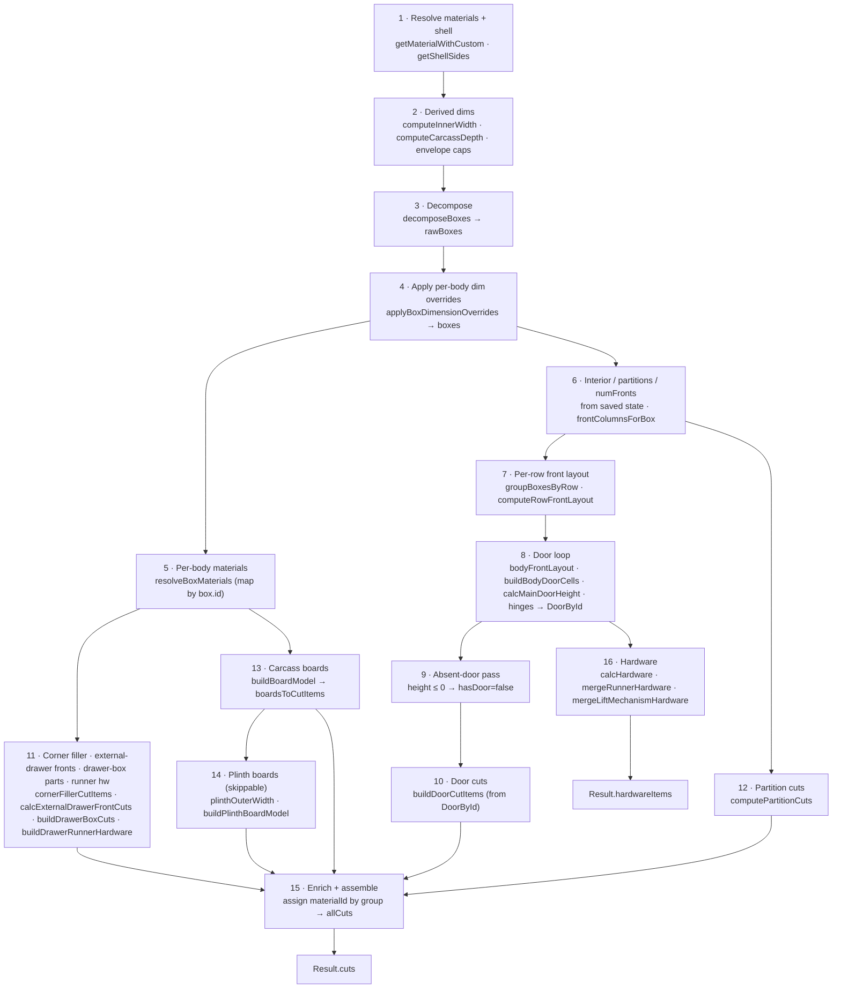
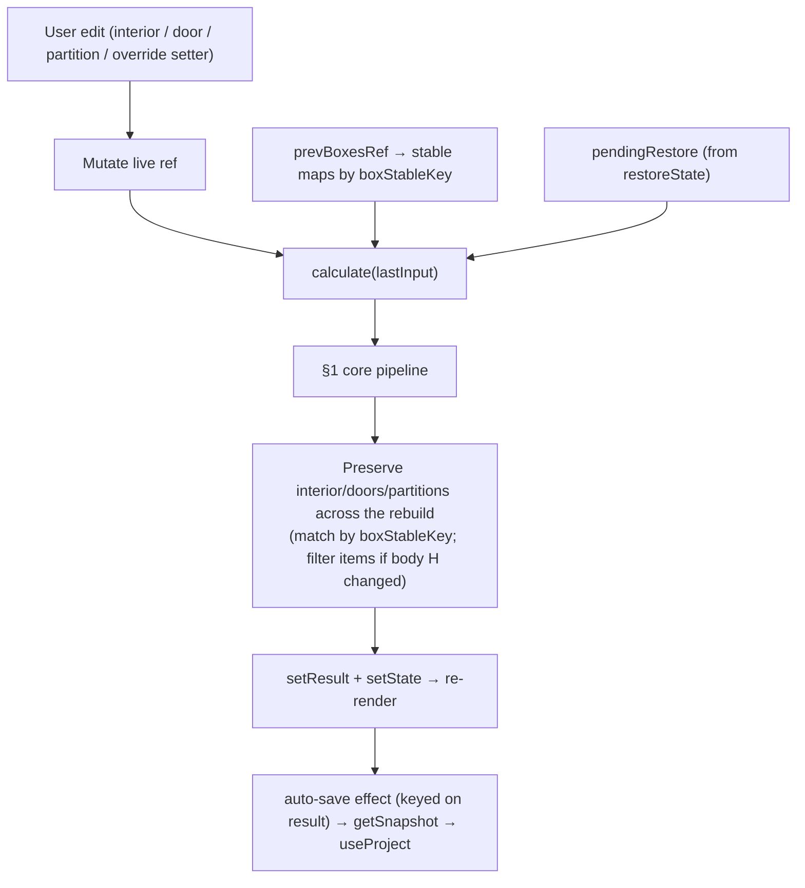
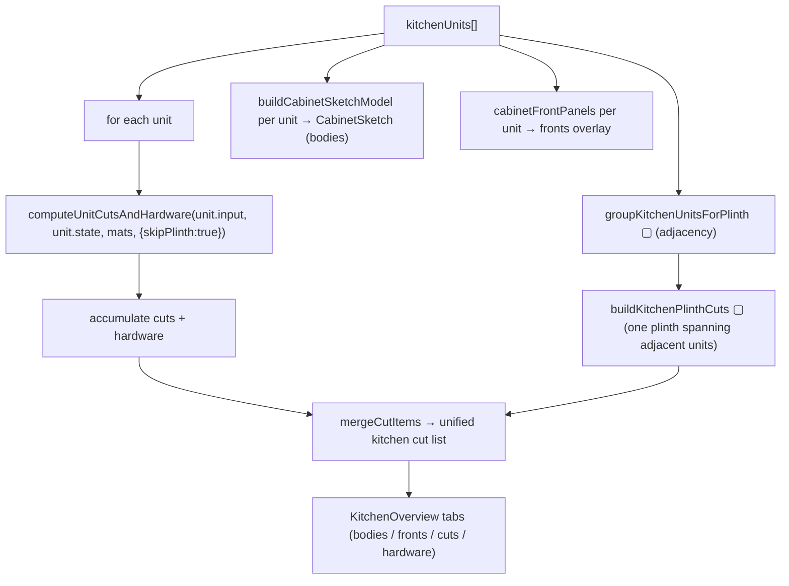
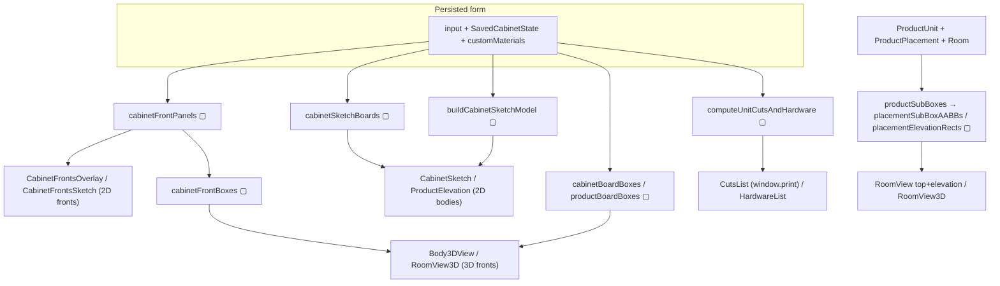
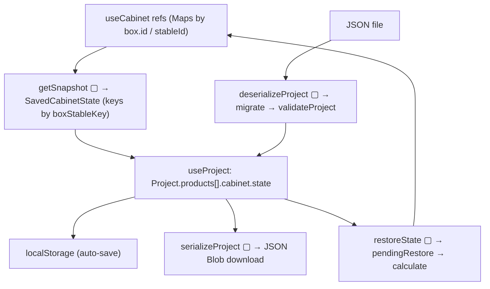

# Pipelines — Carpenter App

> **What this is.** The end-to-end *orchestration* view: the ordered stages a
> `CabinetInput` passes through to become cuts, hardware, and renders — and the
> **shared seams** where the pipelines converge. Where [DATA_FLOW_GRAPH.md](DATA_FLOW_GRAPH.md)
> shows individual value flows, this file shows the *whole recipe* and who runs it.
>
> **How to keep it current.** The pipeline stages are numbered and named after the
> functions that implement them. If you add a stage to `useCabinet.calculate`, add
> it here **and** to `computeUnitCutsAndHardware` (they are mirrored). If a stage
> moves to a shared core function, note it in [§5 Shared seams](#5-shared-seams).

---

## 0. The two orchestrators

Everything runs through **one of two** pipeline drivers. They implement the *same*
recipe; keeping them identical is a standing maintenance obligation.

| | `useCabinet.calculate(input)` | `cabinetCompute.computeUnitCutsAndHardware(input, state, ...)` |
|---|---|---|
| **Kind** | Stateful (React) | Pure |
| **Scope** | One active cabinet | Any cabinet, batchable |
| **Overrides** | Live refs (interactive edits preserved) | Read from `SavedCabinetState` |
| **Outputs** | `CabinetResult` (boxes, cuts, doors, carcassD, innerW, hardware, derivedBoxDims) | `UnitComputeResult` (cuts, hardware) |
| **Extra modes** | interior/door preservation, snapshot/restore | `skipPlinth`, `onlyBoxStableKey` (body-view slice) |
| **Consumers** | `CabinetForm` → all live renderers | `KitchenOverview`, `CabinetForm` 3D preview, tests, parity net |

> ⚠️ **Sync obligation.** `cabinetCompute.ts`'s header: *"If logic in
> useCabinet.calculate() changes, this function must be kept in sync."* A change to
> one that isn't mirrored in the other is the most likely way to ship a
> cabinet-vs-kitchen divergence.

---

## 1. The core compute pipeline (both orchestrators)

**Stage notes (engineering rules baked into each):**

1. **Materials/shell** — `getShellSides` unifies symmetric `hasShell` and per-side
   flags; `tBody`/`tFront` in cm from mm.
2. **Derived dims** — external `W/H/D` → `innerW` (minus shell) + `carcassD` (minus
   back+hinge+front). Wall-cabinet (`mount:'wall'`) adds top+bottom caps.
3. **Decompose** — carcasses, `MAX_BOX_W`/`MAX_BOX_H`/merge rules, corner = `noWidthSplit`.
4. **Dim overrides** — applied *after* decompose (a body overridden past `MAX_BOX_W`
   is not re-split — today).
5. **Per-body materials** — `resolveBoxMaterials` map keyed by `box.id`.
6. **Interior/partitions/numFronts** — pulled from saved state by `boxStableKey`.
7. **Row layout** — per-`level` `RowFrontLayout` at the row's *effective* outer width.
8. **Doors** — per-body sizing; section-split for merged bodies; skirt-cover; hinges.
9. **Absent door** — height ≤ 0 (full drawer stack) ⇒ no door.
10. **Door cuts** — from `DoorById` (tracks overrides), *not* `calcCuts`.
11–14. **Other emitters** — corner/external/drawer-box/partition/carcass/plinth.
15. **Assemble** — `enrich` assigns a group's default material where a cut didn't set one.
16. **Hardware** — base preset + runner replacement + lift replacement.

---

## 2. Live cabinet pipeline (`useCabinet`) — the interactive extras

`calculate` does everything in §1 **plus** state preservation, so an edit doesn't
reset the cabinet:

- **Every override setter re-runs `calculate`** so `result` updates and the
  auto-save effect fires (a door edit that lived only in a ref would be lost when a
  kitchen unit unmounts on "back").
- **`getSnapshot`/`restoreState`** convert live refs ⇄ `SavedCabinetState` (keys by
  `boxStableKey`; hinge ids regenerated).

---

## 3. Kitchen aggregation pipeline (`KitchenOverview`)

`useCabinet` can't loop over units (it's a hook), so the kitchen uses the **pure**
orchestrator per unit and unifies the plinth:

- `skipPlinth:true` prevents per-unit plinths; adjacency grouping yields one kick-board.
- The **overview render** (bodies + fronts) is laid out by `kitchenElevationLayout`
  (base row on the floor, wall row floating), the same layout the 3D uses.

---

## 4. Render pipelines (adapter → renderer)

Each renderer consumes an **adapter**, never raw input. All adapters take
`(input, state, customMaterials)` — the persisted form — so they match the cut list.

**Invariant across all render pipelines:** the adapters are parity-tested against
the cut list (`renderParity.test.ts`) — structural board census, front containment,
door-width match, envelope-cap presence. A renderer that bypasses its adapter and
computes geometry inline breaks the single-source rule (CLAUDE.md) and escapes the net.

---

## 5. Shared seams

Points where multiple pipelines are forced through **one** function so they can't
drift. Keep these as the refactor targets when collapsing duplication.

| Seam | Function(s) | Pipelines forced through it |
|---|---|---|
| **Shell split** | `getShellSides` | all |
| **Derived dims** | `computeInnerWidth`, `computeCarcassDepth` | all |
| **Decompose + override** | `decomposeBoxes`, `applyBoxDimensionOverrides` | live, batch, all 4 adapters |
| **Plinth outer width** | `plinthOuterWidth` | cut list, 2D, 3D, `PlinthEditor` |
| **Column count** | `frontColumnsForBox` | all |
| **Row + per-body layout** | `computeRowFrontLayout`, `bodyFrontLayout` | all |
| **Door dimensions** | `DoorById` → `buildDoorCutItems` | cut list, fronts render |
| **Per-body materials** | `resolveBoxMaterials` | cut list, 2D, 3D |
| **Board model** | `buildBoardModel`, `buildPlinthBoardModel` | cut list, 3D, 2D bodies |
| **Cut folding** | `mergeCutItems` | every cut consumer |
| **Local→room transform** | `placementSubBoxAABBs` | room top, elevation, 3D |
| **Corner geometry** | `cornerModule.*` | cut, 2D, 3D |
| **Stable identity** | `boxStableKey`, `Board.stableId` | all persistence |

**Not yet a single seam (open duplication):** the *sequence* of stages in §1 lives
twice (`calculate` + `computeUnitCutsAndHardware`) and the decompose+layout prologue
lives five times. The auto-split plan is consolidating the decompose seam further.
See [SSOT_MAP.md §Duplicates](SSOT_MAP.md#duplicate-calculations--drift-hazards).

---

## 6. Persistence pipeline

- **`serialize.ts` is boundary-free** — only `Project ↔ JSON`. The Map↔Object bridge
  for live runtime state lives in `useCabinet` (`getSnapshot`/`restoreState`).
- **Migrations** run oldest→current on load; `CURRENT_SCHEMA_VERSION` gates writes.
- **Key stability:** because every record keys off `boxStableKey`/`stableId`, a
  saved project survives recomputation — *unless* a change alters those key formulas
  (then old overrides orphan — the named cost of the per-body identity model).
