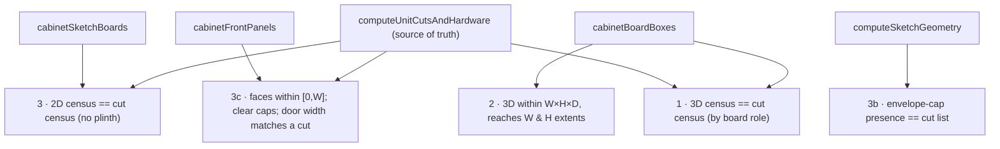

# QA Surface Map — Carpenter App

> **What this is.** A test-oriented reverse-dependency map: for each engineering
> module, *"if I change this, what can break downstream, and which test will catch
> it?"* Plus the inferred invariants and the guard that pins each one. Use it before
> a change (blast radius) and after (did I run the right test?).
>
> **How to keep it current.** When you add a test, add its guard here. When you add a
> module, add its blast-radius row. The 38 core test files are the safety net; this
> file is the index into them. Verification command (CLAUDE.md): `npx tsc --noEmit`
> then `npx vitest run` — **never report success before both pass.**

---

## 1. Blast-radius table — "change X → verify Y"

Ordered by blast radius (widest first). "Guard" = the test(s) that should fail if the
change breaks the contract.

| Module | Blast radius (downstream that can break) | Primary guard |
|---|---|---|
| `geometry/boxDecomposition` | cut list, hardware, 2D bodies, 2D fronts, 3D, kitchen aggregation, body-view slice | `boxDecomposition.test.ts` + `renderParity.test.ts` (census across all paths) |
| `geometry/frontGeometry` | door count/width/x everywhere; drawer-face x; overhang | `frontGeometry.test.ts` + renderParity "door width matches"/"faces within [0,W]" |
| `boards/boardModel` | every carcass dim, role, joint, edging deduction, sheet count, 2D/3D board census | `boardModel.test.ts` + `renderParity.test.ts` |
| `boards/boxMaterials` | cut-list material grouping, 3D colour, cost | `boxMaterials.test.ts` + `cabinetCompute.test.ts` (per-body material) |
| `cabinetCompute` (pure orchestrator) | kitchen aggregation, body-view projection, 3D preview, **parity source of truth** | `cabinetCompute.test.ts` + `renderParity.test.ts` |
| `useCabinet.calculate` (live orchestrator) | all live-cabinet renderers + auto-save | **No direct unit test** — mirror of `cabinetCompute`; covered indirectly. ⚠ gap (see §4) |
| `doors/doorUtils` + `doors/doorCalc` | door heights, hinge markers, skirt cover, external-stack shortening | `doorUtils.test.ts`, `doorCalc.test.ts`, `externalDrawer*.test.ts` |
| `doors/bodyDoors` | section-split door count/keys (merged bodies, dpc=3) | `bodyDoors.test.ts` |
| `doors/drawerFrontsCalc` | external-drawer faces (2D/3D), external cuts | `deriveDrawerFronts.test.ts` |
| `cuts/doorCuts` | door cut dims (override tracking) | `doorCuts.test.ts` + `cabinetCompute.test.ts` |
| `cuts/mergeCutItems` | folded cut list, sheet totals, pair labels | `mergeCutItems.test.ts` |
| `cuts/sheetCalculator` | sheet counts + cost | `sheetCalculator.test.ts` |
| `interior/interiorUtils` (`boxStableKey`) | **all persisted state** — orphaning risk | `serialize.test.ts` + `interiorUtils.test.ts` |
| `interior/fixedShelfUtils` | auto fixed shelf above external drawers | `fixedShelfUtils.test.ts` |
| `hardware/*` | BOM counts + prices | `hardwareCalc.test.ts` |
| `drawers/*` | drawer-box parts, runner NL, drilling datum, priced runner hw, 3D tray | `drawerBox.test.ts`, `drawerBoxCuts.test.ts`, `drawerDrilling.test.ts`, `drawerRunnerHardware.test.ts` |
| `lift/liftMechanismHardware` | AVENTOS BOM (wall cabinets) | `liftMechanismHardware.test.ts` |
| `product/cabinetFronts` | 2D fronts overlay + 3D fronts | `cabinetFronts.test.ts` + renderParity front geometry |
| `product/cabinetBoards3D` | all 3D views | `cabinetBoards3D.test.ts` + `renderParity.test.ts` |
| `product/cabinetSketchModel` | 2D bodies + room elevation | `cabinetSketchModel.test.ts` + `CabinetSketch.utils.test.ts` |
| `product/cornerModule` | corner cut/2D/3D | `cornerModule.test.ts` |
| `product/kitchenModules` | all kitchen module defaults | `kitchenModules.test.ts` |
| `product/kitchenFootprint` | kitchen layout, 3D, room bounds | `kitchenFootprint.test.ts` |
| `product/kitchenPlinth` | unified kitchen plinth | `kitchenPlinth.test.ts` |
| `room/productBounds` + `room/roomGeometry` | room top/elevation/3D placement | `productBounds.test.ts`, `roomGeometry.test.ts` |
| `project/serialize` + `migrations` | save/load, migration correctness | `serialize.test.ts` |
| `cuts/cuttingList` (`calcCuts`) | **legacy only** — off live path | `cuttingList.test.ts` (does not affect production cabinets) |

---

## 2. The parity net — the load-bearing test

`renderParity.test.ts` is the single test that stops the three board-building paths
(cut list, 3D, 2D) from silently diverging. It runs a **15-case cabinet matrix**
(single/multi-body, shell+envelope, 2-row, and every kitchen module incl. קלפה
caps + corner) through four checks:

**If you add a new cabinet shape, module, or render path, add a case to `CASES` in
`renderParity.test.ts`.** That is the cheapest insurance against drift D1/D2 from
[SSOT_MAP.md](SSOT_MAP.md#duplicate-calculations--drift-hazards).

---

## 3. Invariant → guard table

Every invariant from [DEPENDENCY_GRAPH.md §6](DEPENDENCY_GRAPH.md#6-engineering-invariants-inferred-from-code--not-invented),
mapped to the test that pins it. (Inferred from code — none invented.)

| Invariant | Guarding test |
|---|---|
| Entered W/H/D are external; `innerW`/`carcassD` reductions | `boardModel.test.ts`, `cabinetCompute.test.ts` |
| `boxStableKey = "level:position"` is the persistence key | `serialize.test.ts` (round-trip), `interiorUtils.test.ts` |
| `Board.stableId` stable across rebuild | `boardModel.test.ts` |
| Overrides applied after decompose (no re-split) | `cabinetSketchModel.test.ts`, `boxDecomposition.test.ts` |
| Split thresholds 100/200/60/240 | `boxDecomposition.test.ts` |
| Each level = independent front row | `frontGeometry.test.ts` |
| Per-body door sizing; no straddle; ≤1 mm vs row-even | `frontGeometry.test.ts`, `cabinetCompute.test.ts`, renderParity 3c |
| Door cuts track overrides (from `DoorById`) | `doorCuts.test.ts`, `cabinetCompute.test.ts` |
| Cut list = union of emitters | `renderParity.test.ts` (census), `cabinetCompute.test.ts` |
| Render census invariant (3D & 2D == cut) | `renderParity.test.ts` |
| Envelope spans full height, emitted once; front material | `boardModel.test.ts`, `renderParity.test.ts` |
| Shell inset + carcassD use cabinet front material | `boxMaterials.test.ts` |
| Merged body → body-local `internalShelves` + k+1 doors | `boxDecomposition.test.ts`, `bodyDoors.test.ts` |
| Door height ≤ 0 → absent | `cabinetCompute.test.ts` (drawers unit "no phantom door") |
| `hasFronts=false` → no door cuts | `cabinetCompute.test.ts`, `cuttingList.test.ts` |
| Plinth follows bottom row's effective width | `boxDecomposition.test.ts` (`plinthOuterWidth`), `cabinetCompute.test.ts` |
| `sheetsNeeded` skips `back`, applies waste factor | `sheetCalculator.test.ts` |
| `mergeCutItems` folds identical + pairs | `mergeCutItems.test.ts` |
| Room views project one sub-box set via one transform | `roomGeometry.test.ts`, `productBounds.test.ts` |
| `getShellSides` single source | transitively via `boardModel`/`frontGeometry` tests |
| Edging deduction none/front/perimeter | `boardModel.test.ts` (edging suites) |
| Corner = one carcass, fixed door + filler, filler-side hinges | `cornerModule.test.ts`, `cabinetCompute.test.ts` |

---

## 4. Known QA gaps & risks

Honest inventory of where the net is thin — prioritise new tests here.

1. **`useCabinet.calculate` has no direct unit test.** It is the *live* half of the
   duplicated pipeline (SSOT D1). Its correctness is inferred from `cabinetCompute`
   parity, but interactive-only logic (interior/door preservation across rebuilds,
   `getSnapshot`/`restoreState`, `syncFixedShelf` wiring) is exercised only through
   the UI. **Highest-value place to add tests.**
2. **Live vs pure divergence.** Because D1 is hand-mirrored, a bug fixed in one
   orchestrator but not the other passes CI (only the pure path is tested). Mitigate
   by adding the failing case to `cabinetCompute.test.ts` *and* mirroring the fix.
3. **`CabinetSketch.tsx` SVG emission** (the React drawing) is only partially in
   core; `computeSketchGeometry` (layout) + `cabinetSketchBoards` (board set) are
   tested, but the final SVG assembly in the component is not.
4. **No autonomous browser verification** (per project rule). Visual regressions in
   the renderers are caught by geometry parity, not by pixels — so a purely visual
   bug (colour, z-order, label overlap) can pass all tests. Hand these to the
   carpenter as a checklist.
5. **`calcCuts` tests still pass but guard dead code** (SSOT D4). Green here does
   **not** mean the live cabinet door path is covered — that's `doorCuts.test.ts`.
6. **Pricing (`laborCalc`) is untested and unwired** — no consumer, low priority.

---

## 5. Pre-change checklist (by area)

Use this to pick the minimum verification for a change:

- **Touched a dimension/split/layout formula?** → `renderParity.test.ts` +
  the module's own test. This is non-negotiable for `boxDecomposition`,
  `frontGeometry`, `boardModel`.
- **Touched an override / material / edging path?** → `boxMaterials.test.ts`,
  `boardModel.test.ts` edging suites, `cabinetCompute.test.ts`.
- **Touched persistence keys (`boxStableKey`, `stableId`, `SavedCabinetState`)?** →
  `serialize.test.ts` (round-trip) — this is where saved-project orphaning shows up.
- **Touched a compute stage in `calculate`?** → mirror it in `computeUnitCutsAndHardware`
  and add/adjust `cabinetCompute.test.ts`.
- **Added a render path or cabinet shape?** → new `CASES` entry in `renderParity.test.ts`.
- **Touched a catalog value?** → edit JSON only; re-run the catalog-dependent tests
  (`hardwareCalc`, `sheetCalculator`, `drawerRunnerHardware`).
- **Always:** `npx tsc --noEmit && npx vitest run` before reporting done.
