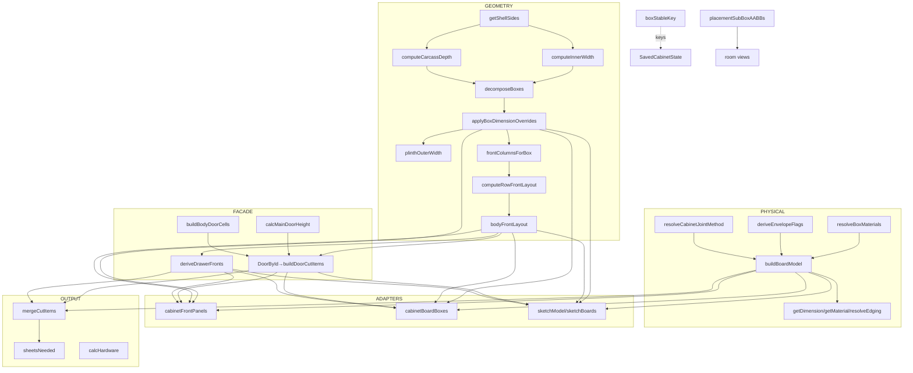

# Single-Source-of-Truth Map — Carpenter App

> **What this is.** A registry of every **single source of truth** (SSOT) in the
> engineering layer: the one function/value that *owns* a fact, who reads it, and
> where the same fact is (dangerously) computed twice. This is the enforcement
> companion to Design Principle #2 ("don't store what you can compute; one source").
>
> **How to keep it current.** When you add a derived value, ask: *does an SSOT for
> it already exist?* If yes, route through it and add yourself as a reader. If no,
> create one pure function and register it here. When you catch a duplicate, log it
> in [Duplicate calculations](#duplicate-calculations--drift-hazards).

---

## 1. SSOT registry

Each SSOT owns a fact. **Never recompute the fact elsewhere — import the owner.**

| # | Fact owned | Owner (function / value) | File | Readers |
|---|---|---|---|---|
| T1 | **Per-side shell** (left/right) | `getShellSides` | `types/cabinet.ts` | decompose, layout, boards, all orchestrators + adapters |
| T2 | **Inner width** `W − shell(s)` | `computeInnerWidth` | `core/boards/boardModel.ts` | orchestrators, adapters, sketch geometry |
| T3 | **Carcass depth** `D − back − hinge − front` | `computeCarcassDepth` | `core/boards/boardModel.ts` | orchestrators, adapters |
| T4 | **Carcass decomposition** (splits, merges, `internalShelves`) | `decomposeBoxes` | `core/geometry/boxDecomposition.ts` | orchestrators, all 4 adapters |
| T5 | **Per-body dim override application** | `applyBoxDimensionOverrides` | `core/geometry/boxDecomposition.ts` | orchestrators, adapters |
| T6 | **Plinth effective outer width** | `plinthOuterWidth` | `core/geometry/boxDecomposition.ts` | cut list, 2D, 3D, `PlinthEditor` |
| T7 | **Column count per body** | `frontColumnsForBox` | `core/geometry/frontGeometry.ts` | orchestrators, adapters |
| T8 | **Row front layout** (x, width per column) | `computeRowFrontLayout` | `core/geometry/frontGeometry.ts` | orchestrators, adapters |
| T9 | **Per-body front layout / sizing** | `bodyFrontLayout`, `bodyFrontX`, `bodySpanGeometry` | `core/geometry/frontGeometry.ts` | door loop, external fronts, adapters |
| T10 | **Physical board model** (dims/roles/joint/edging) | `buildBoardModel`, `buildPlinthBoardModel`, `boardsToCutItems` | `core/boards/boardModel.ts` | cut list, 3D, 2D bodies, PlinthEditor |
| T11 | **Effective board dim/material/edging** | `getDimension`, `getMaterial`, `resolveEdging` | `core/boards/boardModel.ts` | `boardsToCutItems`, sketches |
| T12 | **Which body carries the envelope** | `deriveEnvelopeFlags` | `core/boards/boardModel.ts` | cut list, 3D, 2D |
| T13 | **Joint method** (rabbet/butt) | `resolveCabinetJointMethod` | `core/boards/boardModel.ts` | all board builders |
| T14 | **Effective per-body materials** | `resolveBoxMaterials` | `core/boards/boxMaterials.ts` | cut list, 2D, 3D |
| T15 | **Catalog material (+ custom)** | `getMaterialWithCustom` / `materialCombiner` | `catalog/*` | everywhere materials are read |
| T16 | **Door dimensions** (width/height) | `DoorById` (built in orchestrators) → `buildDoorCutItems` | `core/cuts/doorCuts.ts` | cut list, DoorsList, fronts render |
| T17 | **Door row/height split** | `calcDoors` | `core/doors/doorCalc.ts` | orchestrators, legacy `calcCuts` |
| T18 | **Main-door height vs external stack** | `calcMainDoorHeight`, `calcExternalStackHeight` | `core/doors/doorUtils.ts` | door loop, fronts |
| T19 | **Section-split cells** (merged bodies) | `buildBodyDoorCells`, `makeSavedDoorKey` | `core/doors/bodyDoors.ts` | door loop (both paths), fronts |
| T20 | **External-drawer faces** | `deriveDrawerFronts` | `core/doors/drawerFrontsCalc.ts` | fronts render, external cuts |
| T21 | **Stable body identity** | `boxStableKey = "level:position"` | `core/interior/interiorUtils.ts` | **all persisted state** |
| T22 | **Item physical span / gaps** | `physicalZone`, `computeInteriorGaps` | `core/interior/interiorUtils.ts` | shelf warnings, gap display (2D) |
| T23 | **Front faces for render** | `cabinetFrontPanels` | `core/product/cabinetFronts.ts` | 2D overlay, 3D fronts |
| T24 | **3D board geometry** | `cabinetBoardBoxes` / `productBoardBoxes` | `core/product/cabinetBoards3D.ts` | `Body3DView`, `RoomView3D` |
| T25 | **2D sketch props / boards** | `buildCabinetSketchModel`, `cabinetSketchBoards` | `core/product/*` | `CabinetSketch`, `ProductElevation` |
| T26 | **Corner geometry** (door/filler/return) | `cornerModule.*` | `core/product/cornerModule.ts` | cut, 2D, 3D |
| T27 | **Kitchen layout / elevation** | `kitchenElevationLayout`, `kitchenFootprint` | `core/product/kitchenFootprint.ts` | overview, 3D, room bounds |
| T28 | **Kitchen unified plinth** | `groupKitchenUnitsForPlinth`, `buildKitchenPlinthCuts` | `core/product/kitchenPlinth.ts` | `KitchenOverview` |
| T29 | **Product bounds / sub-boxes** | `productBounds`, `productSubBoxes` | `core/room/productBounds.ts` | room top/elevation/3D |
| T30 | **Local→room transform** | `placementSubBoxAABBs` | `core/room/roomGeometry.ts` | room top, elevation, 3D |
| T31 | **Cut folding** | `mergeCutItems` | `core/cuts/mergeCutItems.ts` | `CutsList`, sheet totals |
| T32 | **Sheet count** | `sheetsNeeded` / `sheetsNeededByGroup` | `core/cuts/sheetCalculator.ts` | `CutsList` |
| T33 | **Hardware BOM** | `calcHardware` → `buildHW` | `core/hardware/*` | `HardwareList`, overview |
| T34 | **Live cabinet state** | `useCabinet` | `ui/hooks/useCabinet.ts` | `CabinetForm` + all live renderers |
| T35 | **Persisted override schema** | `SavedCabinetState` | `types/project.ts` | `serialize`, adapters, orchestrators |

---

## 2. SSOT ownership diagram

---

## 3. Rendering adapters vs. sources of truth

The distinction that matters most for correctness:

- **A source of truth** *decides* a fact (dimension, count, position). Changing it
  changes the product.
- **An adapter** *re-expresses* facts already decided, in a renderer's shape. It must
  **not** decide anything new; if it does, it's a hidden second source → drift.

| Adapter | Re-expresses | Owns nothing except | Parity guard |
|---|---|---|---|
| `cabinetFrontPanels` (T23) | doors + drawer faces → floor-up `FrontPanel[]` | pixel-frame coords + hinge-marker side | renderParity front geometry |
| `cabinetBoardBoxes` (T24) | boards → 3D `BoardBox3D[]` + fixtures | Z-placement per role (`boardDepthRange`), fixture schematics | renderParity 3D census |
| `cabinetSketchBoards` (T25) | boards → 2D `Board[]` | — (thin) | renderParity 2D census |
| `buildCabinetSketchModel` (T25) | layout + interior → props | SVG-scale-agnostic bundle | via front-geometry parity |
| `placementSubBoxAABBs` (T30) | sub-boxes → room AABBs | the rotation math (shared) | `roomGeometry.test.ts` |

> **Litmus test for a new render feature:** if you're about to write `decomposeBoxes`
> or a width formula inside a component or adapter, stop — consume the orchestrator
> output or an existing adapter instead.

---

## 4. Duplicate calculations & drift hazards

The SSOT principle is violated (knowingly) in these places. Each is a live risk.

### D1 — Orchestrator duplication *(highest risk)*
`useCabinet.calculate` and `computeUnitCutsAndHardware` implement the **same 16-stage
pipeline** twice — stateful vs pure. There is no shared "pipeline" function; the two
are hand-mirrored.
- **Why it exists:** `useCabinet` is a React hook and can't be called in a loop for
  kitchen aggregation; `computeUnitCutsAndHardware` is the loopable pure twin.
- **Guard:** `renderParity.test.ts` + `cabinetCompute.test.ts` exercise the pure path;
  divergence in the *live* path can still slip if the same case isn't tested.
- **Refactor target:** extract the shared stage sequence into a pure
  `computePipeline(input, overrides)` both call. Blocked historically on the
  interactive preservation logic that only `calculate` needs.

### D2 — Five-path decompose+layout prologue
`decomposeBoxes → applyBoxDimensionOverrides → groupBoxesByRow → computeRowFrontLayout
→ frontColumnsForBox` appears in **five** files: `useCabinet`, `cabinetCompute`,
`cabinetFronts`, `cabinetBoards3D`, `cabinetSketchModel`.
- **Guard:** `renderParity.test.ts` censuses the board roles the five paths produce.
- **Mitigation so far:** `applyBoxDimensionOverrides` + `plinthOuterWidth` are shared
  helpers; the auto-split plan collapses more into `boxDecomposition`.

### D3 — `buildBoxLabel` copy
Duplicated verbatim in `useCabinet.ts` and `cabinetCompute.ts` (comment: "keep in
sync"). Cheap to extract to a shared helper.

### D4 — `calcCuts` legacy door/carcass path
`cuttingList.calcCuts` still contains a full cabinet door+drawer emission, but **no
orchestrator calls it** — doors come from `buildDoorCutItems`, carcass from
`buildBoardModel`, drawer-box parts from `buildDrawerBoxCuts`. It survives only for
non-cabinet furniture types and unit tests.
- **Risk:** someone "fixes" a door rule in `calcCuts` expecting it to take effect —
  it won't. Candidate for deletion once legacy types are confirmed unreachable.

### D5 — `core/index.ts` barrel
Re-exports ~30 symbols; only `decomposeBoxes` + `calcDoors` are consumed through it.
Hides dead code from `ts-prune`. Cleanup, not a bug.

### D6 — Front layout: two models coexist
`computeRowFrontLayout` (row-even) and `bodyFrontLayout` (per-body) both exist.
Per-body is the current door-sizing source (T9/T16); row-even is still used for the
row's available-width bookkeeping and drawer cell width. They agree for uniform bodies
within ≤1 mm — but a change to one must be checked against the other.

---

## 5. Where facts are *deliberately* stored (not recomputed)

SSOT says "compute, don't store" — but a few values are persisted on purpose because
they encode a **user choice**, not a derivation:

| Stored value | Where | Why it's stored, not derived |
|---|---|---|
| `boxDimensionOverrides` | `SavedCabinetState` | Carpenter's explicit per-body size (freedom principle) |
| `boxMaterialOverrides` | `SavedCabinetState` | Explicit per-body material choice |
| `boardOverrides` (dim/material/edging) | `SavedCabinetState` | Explicit per-board tweak |
| `plinthGableOverrides` | `SavedCabinetState` | Dragged gable position |
| `bodyEdgingOverrides` / `doorEdgingOverrides` | `SavedCabinetState` | Explicit banding choice |
| `SavedDoor` (hingeSide/count/hinges/hasDoor/thickness) | `SavedCabinetState.doors` | User's hinge edits; derived fields (height/width/coversSkirt) are **not** stored |
| `interior` / `cellInterior` / `partitions` | `SavedCabinetState` | User-placed items |

Everything else (box dims, door heights, board dims, cuts, hardware, gaps, sheet
counts) is **derived on demand** and never persisted — per Design Principle #2 and
the CLAUDE.md rule "don't store `displayNumber`, `visualHeight`, `skirtExtension`".
